<div align="center">

# DayPilot Enterprise

### The local-first AI operating room for professional work

**Plan, execute, monitor, and continue a real workday from one calm command center.**
Governed multi-agent orchestration · HomePilot persona portability · MCP tool contracts · private RAG memory · production-grade observability.

<p>
  
  
  
  
  
  
</p>

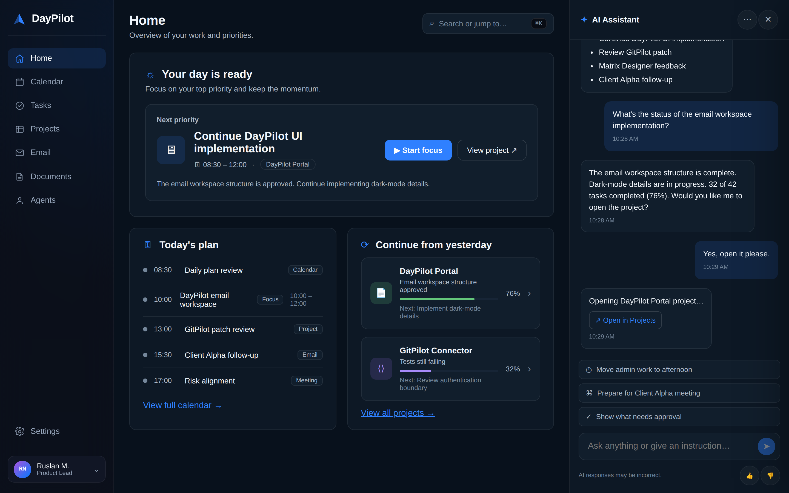

</div>

---

> **DayPilot = Calendar + Tasks + Projects + Agents + Documents + Natural Tools.**
>
> Open it every morning and it answers: *What should I do now? What is AI doing for me?
> Which project needs attention? What changed since yesterday? What needs my approval?*

DayPilot is a premium, daily-use AI command center for an AI/ML principal engineer or
technical executive juggling thousands of tasks, many repositories, client obligations,
inbox pressure, agent runs, and document workflows at once. It routes coding to
**GitPilot** (with **Claude Code** and **Codex** as optional executors), models to
**Ollabridge**, planning and design review to **Matrix Designer**, and inbox triage to the
**Email Sentinel**. A governed **Integration Gateway** connects external providers
(Slack, GitHub, Calendar) and **MCP servers** through one permission + approval model —
while keeping every sensitive action human-approved, audited, and reversible. It is part
of the **HomePilot Family** and shares its calm, obsidian design language across desktop,
web, and a mobile PWA.

## Table of contents

- [Product tour](#product-tour) · [Why DayPilot](#why-daypilot) · [Architecture](#architecture)
- [Production readiness](#production-readiness) · [Quick start](#quick-start) · [Configuration](#configuration)
- [Documentation](#documentation) · [Security & governance](#security--governance) · [Tech stack](#technology-stack)

---

## Product tour

### First run — a minimalist setup

On first launch a **three-step onboarding** (identity → mailbox → one knowledge source for RAG)
gets you productive in under a minute. It stays deliberately minimal — **Skip for now** is always
there, and everything advanced lives in Settings.

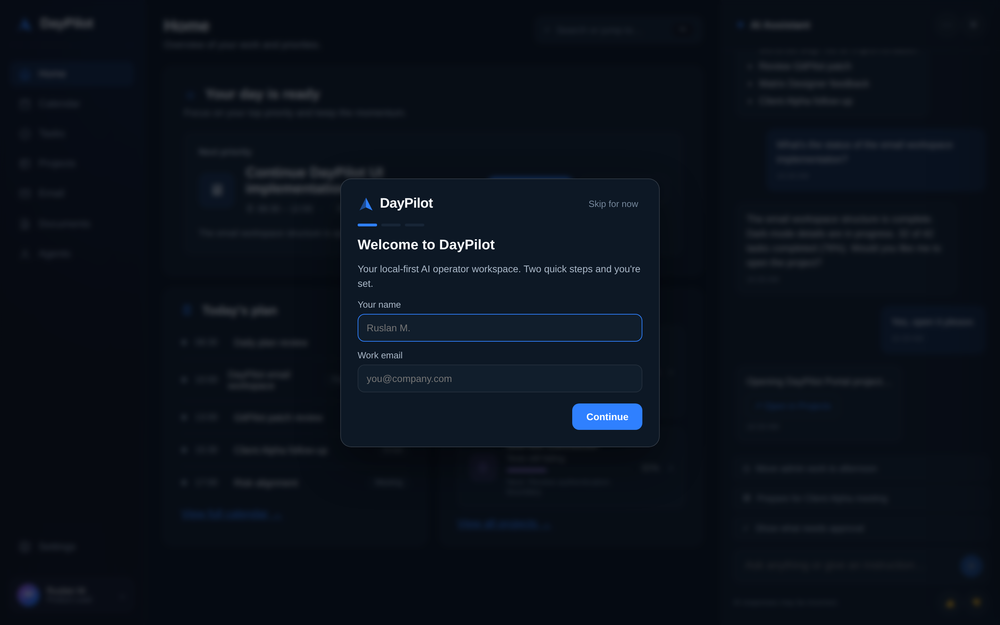

### Home — your day at a glance

A calm, enterprise Home workspace with three regions: navigation, a readable main column
(**Next priority**, **Today's plan**, **Continue from yesterday**), and a single **collapsible
AI Assistant** on the right. There is one place to talk to AI (the assistant panel) and one to
navigate (the **⌘K** command palette). Clean **DayPilot** branding, and a **ChatGPT-style settings
drop-up** pinned bottom-left. (See the hero image above.)

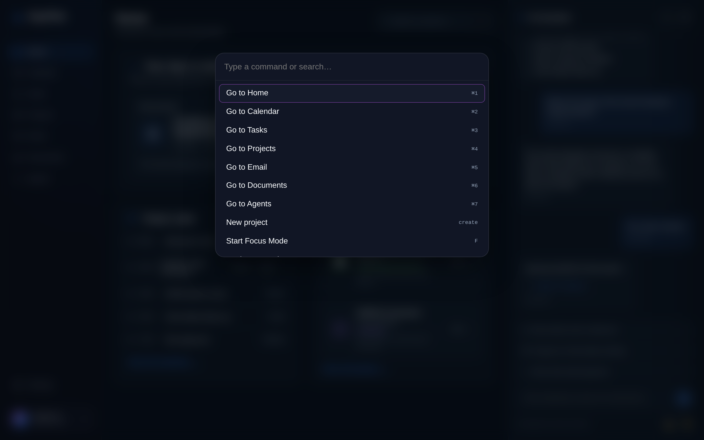
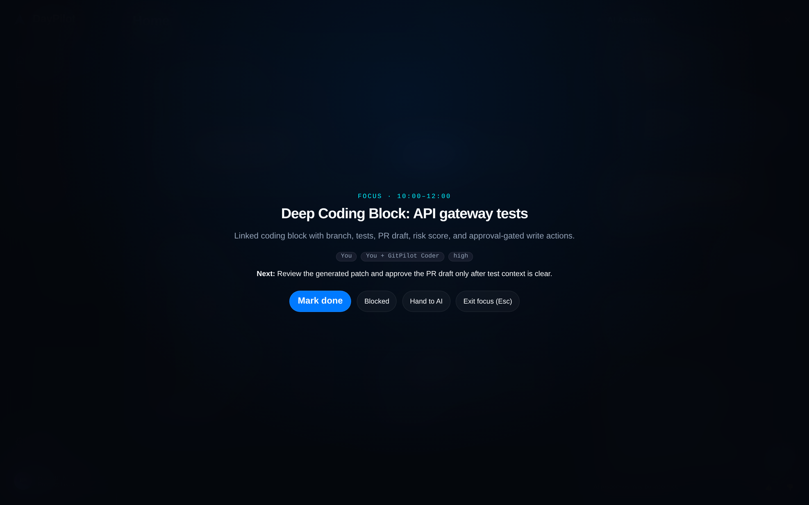

**Focus Mode** hides everything except the current block, its context, and the allowed
actions (done / blocked / hand to AI) — the "what do I do now?" mental mode made real.

### Planning — a multi-agent optimized day

A **simple multi-agent planner** (LangGraph-shaped graph: prioritize → schedule → critic loop →
finalize, Ollabridge-compatible) turns your open tasks into an **optimized day**: deep work
protected in the morning energy peak, meetings batched after lunch, admin closed out at the end,
lunch untouchable. The critic scores every candidate (focus share, context switches, priority
coverage) and re-runs the scheduler until the plan beats the bar — the score badge is its verdict.
**Every block is clickable** (Start focus · Mark done · Move ±30 min), **Replan** is one tap, and a
**chat panel** lets you converse with your plan ("move admin to the afternoon" replans it). The
planner itself improves through time via a governed loop: plan metrics → periodic review → tuned
config proposal → **Approval Center** → new config version. See
[`docs/planner-multi-agent.md`](docs/planner-multi-agent.md).

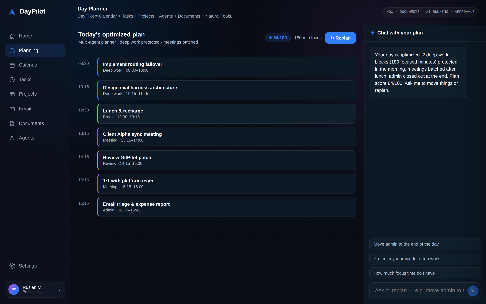

### Create a project in seconds

A small, essentials-only **project wizard** (name, goal, stack, repository, first milestone)
opens from the command palette, the Projects view, or the mobile drawer — so a principal engineer
can spin up a project without a form marathon.

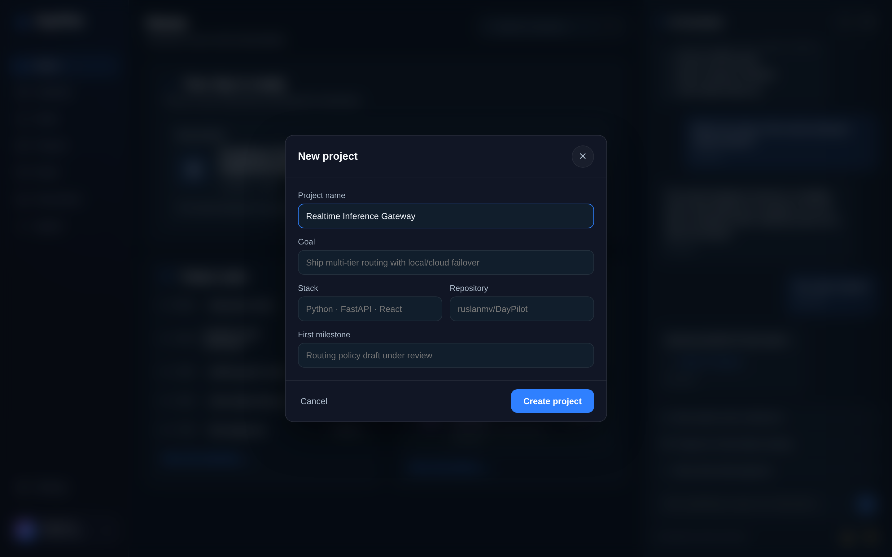

### Pair with Ollabridge — local or cloud

DayPilot pairs with the **local Ollabridge gateway** or **Ollabridge Cloud** — the same
OpenAI-compatible endpoint, so pairing works the same way (one base URL + a Bearer key). Local is
private-by-default; Cloud adds relay, premium routing, and TV-style device pairing. Per-agent
routing, health, latency, and fallback are shown alongside.

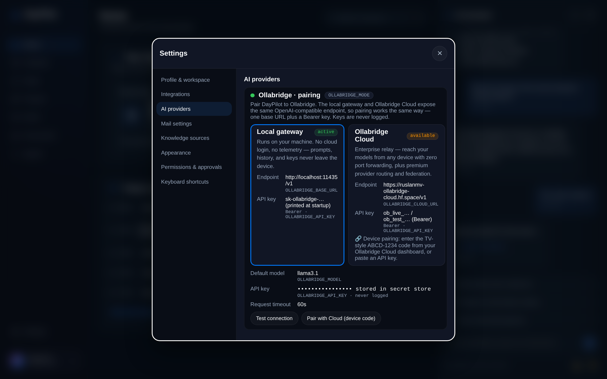

### Knowledge sources & mail — the RAG and inbox essentials

Grant **local folders or Box** so the AI can answer over your projects (read + index only, RAG),
and connect an **IMAP/SMTP mailbox** whose send policy stays approval-gated. Every section is
reachable from an in-panel nav so phones get the full settings surface too.

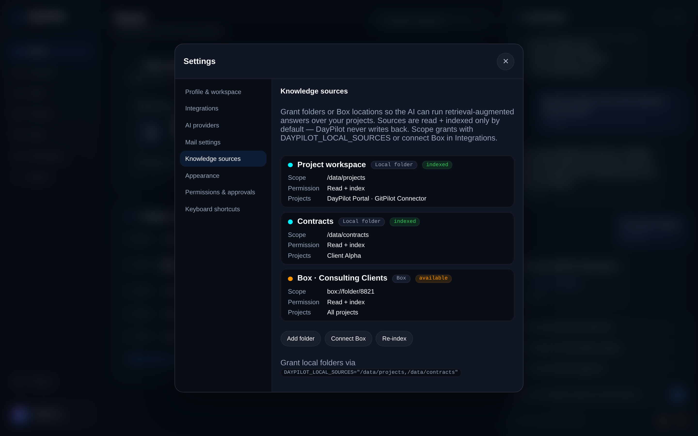
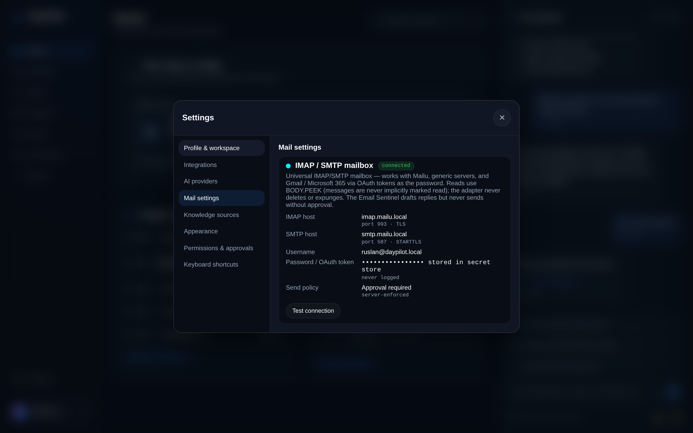

### Email — an optional, non-destructive workspace

A single optional, feature-flagged Email tab with an Outlook-familiar five-region layout and
an **AI Email Assistant** (Draft + Chat) that drafts and revises replies conversationally.
The AI never sends and never edits the mailbox — a Copilot-style **Add to email** inserts the
draft into the editable composer with **Undo**, and Send stays in the composer. Works in both
dark and light themes.

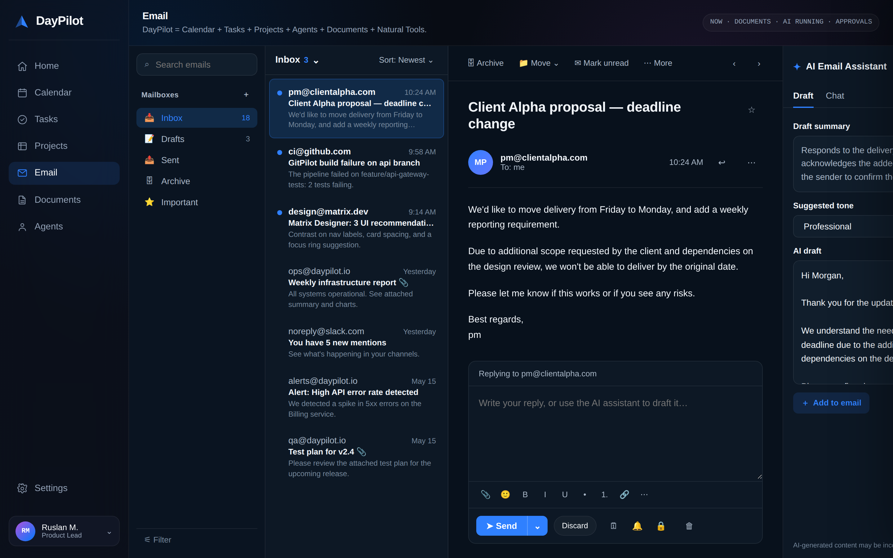

<details>
<summary>Light theme</summary>

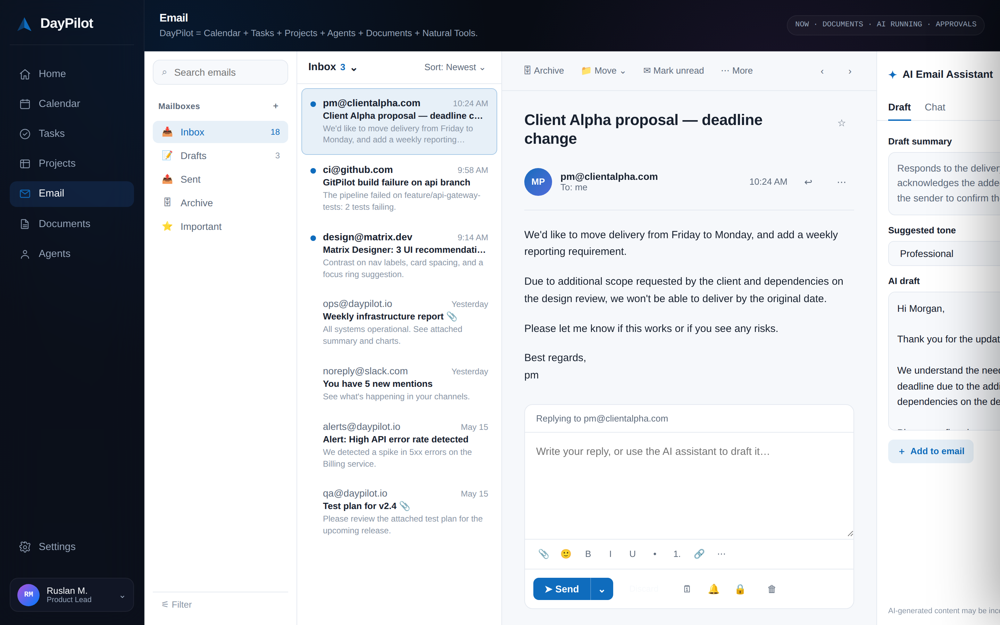

</details>

### Coding review and design planning

<table>
<tr>
<td width="50%">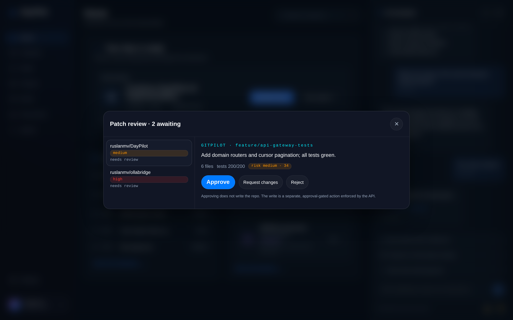</td>
<td width="50%">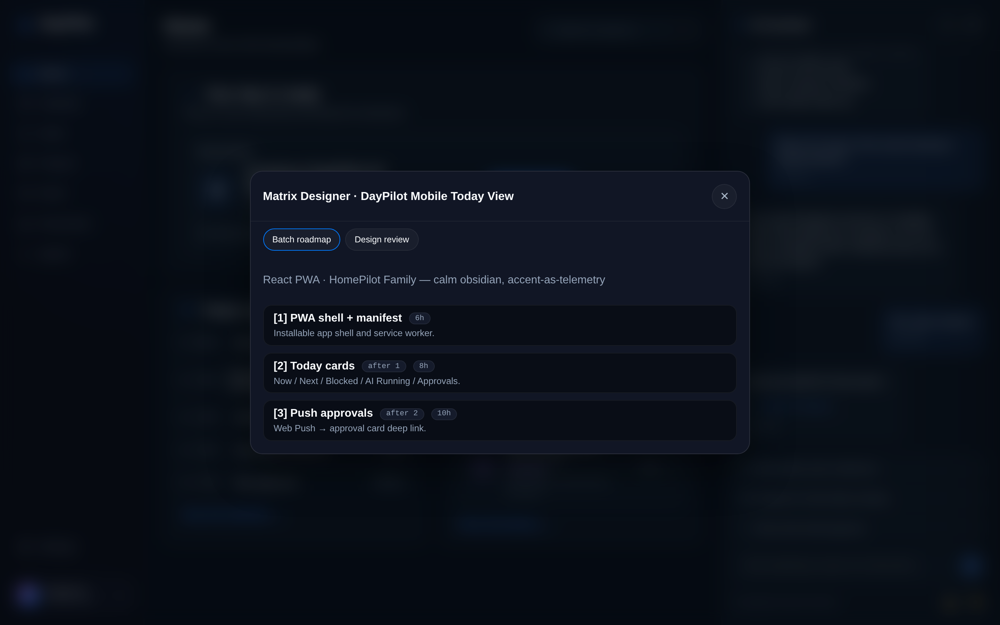</td>
</tr>
<tr>
<td align="center"><b>GitPilot</b> — approval-gated patch review with risk scoring; writes never happen without sign-off.</td>
<td align="center"><b>Matrix Designer</b> — turns ideas into a dependency-aware batch roadmap that GitPilot builds.</td>
</tr>
</table>

### AI staff — Agents

Your **AI staff**: a directory of HomePilot personas you connect to and put to
work, each shown with its own portrait pulled straight from the persona. Open an
agent for a dedicated workspace — a live conversation plus a task rail (Active /
Waiting for approval / Completed). Agents **propose** work; nothing is sent,
changed, or delegated without your approval. HomePilot owns the agents — DayPilot
never copies their identity or memory. See [`docs/agents-ui.md`](docs/agents-ui.md).

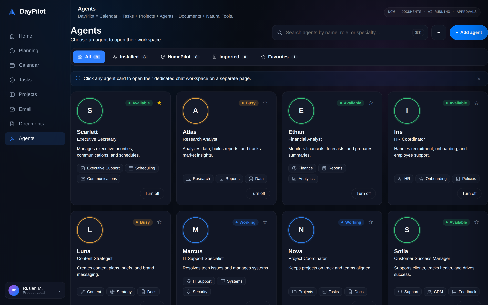

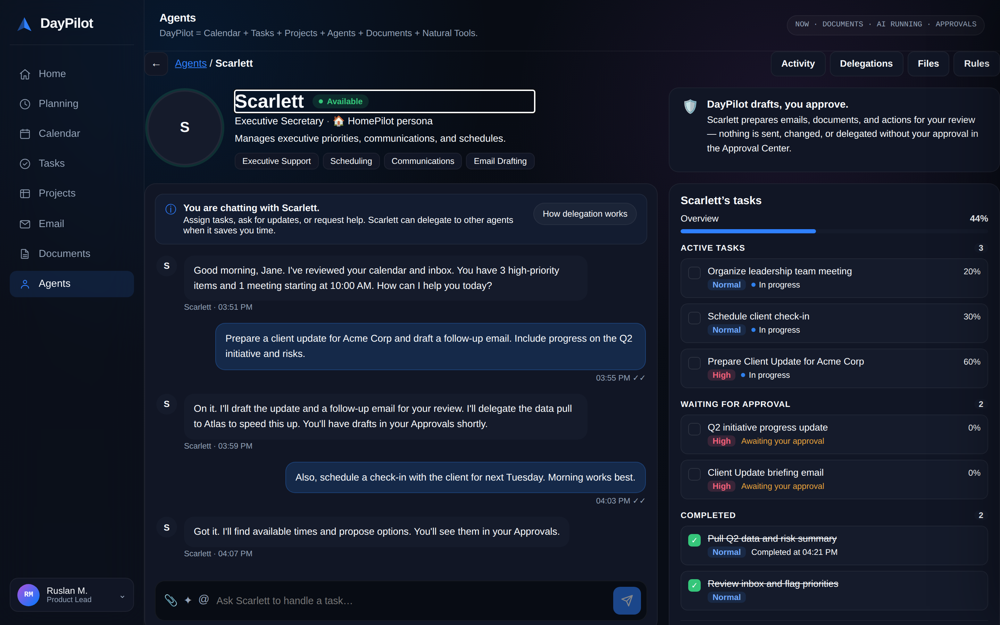

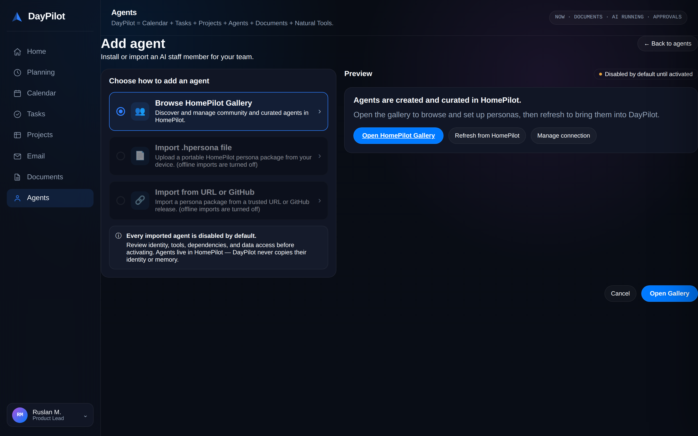

### Approval Center

Every sensitive action — email sends, calendar writes, repo writes/PRs, file generation,
persona enablement — flows through one governed **Approval Center**.

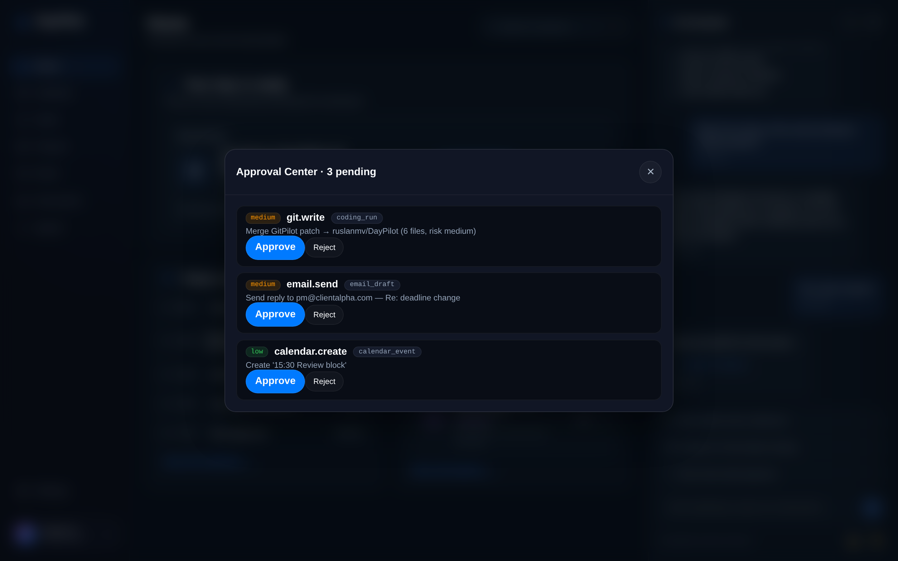

### Integrations — one governed gateway

External providers and MCP servers connect through a single **Integration Gateway** with
one permission model: **reads run immediately; every write, send, or destructive action is
approval-gated**, audited, and reversible. The AI can only *request* a tool — it never calls
a provider or MCP server directly.

- **Providers** — Slack (mention → notification → AI draft → approve → send, draft-only by
  default), GitHub, and Google Calendar, all behind one `IntegrationProvider` interface.
- **MCP** — attach remote (Streamable HTTP) or local (STDIO) MCP servers; tools are
  auto-classified read/write/destructive (admin-overridable) and start disabled.
- **Unified notifications** — every provider normalizes to one event shape and one center,
  grouped by severity, with per-integration delivery rules.
- **Cross-integration workflows** — simple, opt-in, predefined (e.g. Slack message → task,
  GitHub failure → notify) — outbound steps stay approval-gated.
- **Private platform** — a curated (not public) catalog with tiers, integration manifests, a
  conformance/certification suite, and an SDK so internal or third-party teams can build
  integrations **outside** the core repo.

Credentials live in the secrets backend (never the database, logs, or prompts), and
disconnect revokes them. See [`docs/integrations.md`](docs/integrations.md) and the
[integration platform plan](docs/integration-platform-plan.md).

### On the phone — a ChatGPT-style mobile shell

Below 768px the full console becomes a dedicated mobile shell: a top app bar (hamburger · title ·
✦), an off-canvas drawer that combines navigation with recent AI conversations, a single vertical
Home, and a **full-screen AI chat** with a fixed composer. The installable **mobile PWA** also
gives a fast offline Today check-in with push-ready approvals.

<p>
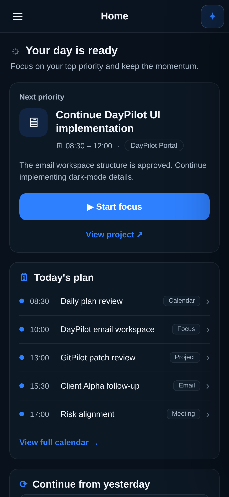
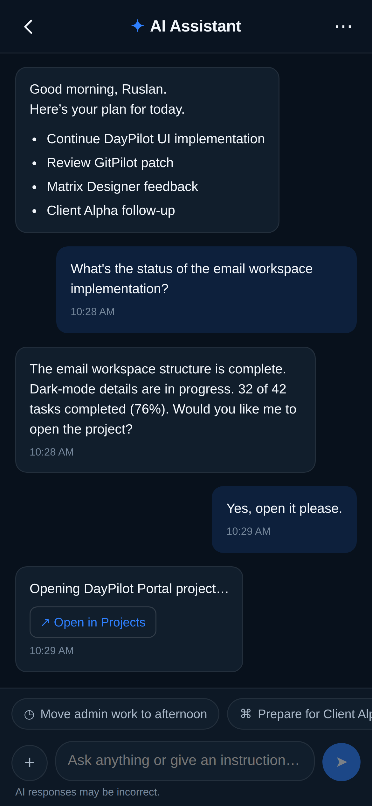
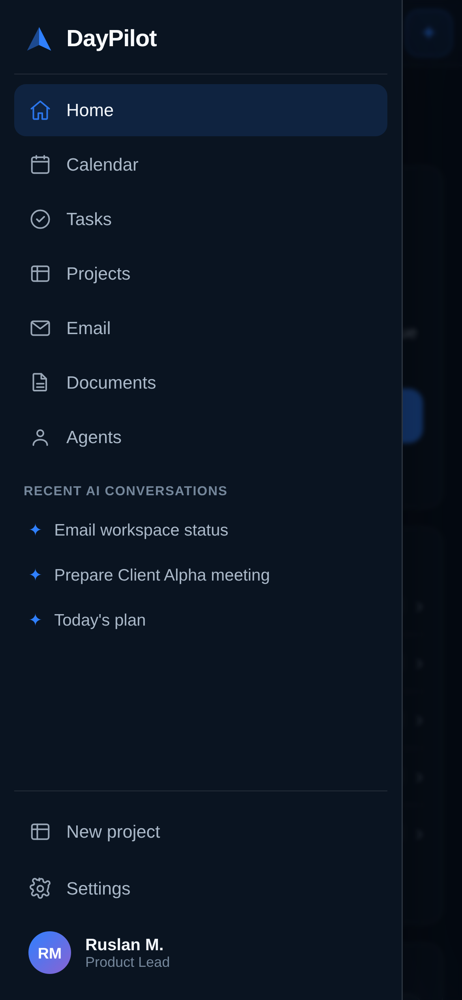
</p>

### Verified end to end

A real, reproducible **five-day week simulation** for a principal AI/ML engineer pairs DayPilot to
a local Ollabridge-compatible endpoint and drives planning, coding, email drafting, and RAG with
**20 real inferences** — while the governance contract holds (0 emails sent, 0 unapproved writes,
5/5 approvals, continuity carried across days). Run it with `make sim`; the full write-up is
[`docs/simulation/week_report.md`](docs/simulation/week_report.md).

---

## Why DayPilot

Modern AI products often stop at a chat box. DayPilot starts from the opposite assumption:
in a professional environment, AI actions must be **observable, reversible, governed,
auditable, and human-approved**. It is designed for daily use, not occasional
administration — the operating room for the day.

| Mental mode | User question | DayPilot behavior |
|---|---|---|
| Morning planning | What is my day? | Summarize Now / Next / Later, AI running, blockers, documents, approvals. |
| Focus execution | What do I do now? | Focus Mode: current block, context, allowed actions only. |
| AI delegation | What can AI do? | Route coding, document, email, design, and scheduling tasks to agents. |
| Review & approval | What needs me? | One Approval Center queue of decisions that require a human. |
| Project continuity | Where did I stop? | Restore yesterday's state, linked docs, branches, blockers, next action. |
| Mobile check-in | What changed while away? | Compact Now / Blocked / AI Running / Approvals on phone. |
| End-of-day wrap | What happened and what's next? | Progress, risks, generated outputs, and tomorrow's draft plan. |

### Default tool roles

| Tool / agent | Role |
|---|---|
| **Ollabridge** | Default LLM provider abstraction; pairs with the local gateway or Ollabridge Cloud (same OpenAI-compatible endpoint) for local / hybrid / cloud routing. |
| **GitPilot** | Default retro-compatible coding workflow bridge (Ask / Auto / Plan modes). |
| **Claude Code / Codex** | Optional coding executors behind the same coding-workflow interface. |
| **Matrix Designer** | Planner and design-quality reviewer for UI, decks, reports, and product surfaces. |
| **Email Sentinel** | Inbox monitor, urgency classifier, response drafter, schedule-impact detector. |
| **Document Assistant** | Reads, summarizes, compares, and turns documents into tasks or version-safe outputs. |
| **Approval Center** | Central queue of human decisions required before sensitive actions. |

---

## Architecture

DayPilot is a production-oriented monorepo separating operator experience, API ingress,
orchestration, MCP tool governance, knowledge retrieval, model routing, observability,
local data, infrastructure, and shared contracts.

```text
Operator UI (web · desktop · mobile PWA)
        │
   API Gateway (FastAPI)  ──  request tracing · auth/RBAC · pagination · SSE events
        │
   ┌────┴─────────────┬──────────────────┬─────────────────┐
 Orchestrator     MCP Host          Knowledge Service   Model Serving
 plan lifecycle   tool contracts    parsers · RAG        Ollabridge routing
 coding/email/    .hpersona bridge  version-safe outputs  health · fallback
 design agents    approvals/policy  hybrid retrieval
 Integration Gateway (providers · MCP · notifications · workflows · catalog)
        │
   Postgres · Redis · Qdrant · durable job queue · audit log · observability
```

### Repository map

| Area | Path | Purpose |
|---|---|---|
| Operator web UI | `apps/operator-web` | React/Vite web command center. |
| Desktop shell | `apps/operator-desktop` | Tauri desktop wrapper. |
| Mobile PWA | `apps/mobile-pwa` | Installable phone companion (offline Today, push approvals). |
| HomePilot Family theme | `packages/homepilot-theme` | Shared design tokens, state language, light/dark semantics. |
| UI bridge | `packages/ui-bridge` | Home, mobile shell, Email workspace, Focus Mode, palette, settings, onboarding + project wizards. |
| Shared contracts | `packages/shared-types` | TypeScript domain + API contracts. |
| MCP contracts | `packages/mcp-contracts` | Typed tool contracts incl. the coding-workflow contract. |
| API gateway | `services/api-gateway` | Ingress: domain APIs, auth/RBAC, tracing, SSE, providers, coding, email, calendar, documents, jobs, integrations, MCP, notifications, catalog. |
| Orchestrator | `services/orchestrator` | Plan lifecycle, coding/email/design agents, approvals, jobs, security, **integration platform** (`integrations/`: gateway, providers, MCP, notifications, workflows, manifests, SDK). |
| MCP host | `services/mcp-host` | Tool registry and HomePilot `.hpersona` bridge. |
| Knowledge service | `services/knowledge-service` | Parsers, permissions, hybrid retrieval, Document AI, RAG eval. |
| Model serving | `services/model-serving` | Ollabridge client, per-role routing, provider health. |
| Observability | `services/observability` | Traces, metrics, structured logging. |
| Infrastructure | `infra` | Docker, Kubernetes, Terraform, Prometheus alerts + Grafana dashboard. |
| E2E simulation | `scripts/e2e_week_simulation.py` · `scripts/sim/` | Real 5-day week run: pairing + inference + governed workflow (`make sim`). |

### Integration roles

| System | Role |
|---|---|
| HomePilot | Local context, personal workflows, personas (`.hpersona` portability) |
| GitPilot | Coding tasks, branches, PRs, tests, patches, code review |
| Matrix Designer | UI/UX suggestions, design review, batch roadmap planning |
| Ollabridge | AI provider layer for local/hybrid/cloud model execution |
| Integration Gateway | One governed entry for external providers and MCP servers (permission model + approvals + audit) |
| Slack / GitHub / Google Calendar | External providers behind the shared `IntegrationProvider` interface |
| MCP servers | Remote (Streamable HTTP) / local (STDIO) tool servers, classified and policy-governed |
| DayPilot | Daily planning, scheduling, monitoring, approvals, continuity |

---

## Production readiness

DayPilot has been built out from scaffold to a production-ready system across an ordered,
dependency-aware roadmap (see [`docs/production-plan.md`](docs/production-plan.md)). Every
batch landed as a reviewed changeset with tests and browser-verified UI.

| Area | What's implemented |
|---|---|
| **Foundation** | Reproducible toolchain, pinned deps, CI matrix (Python, TS build/typecheck/lint, `docker compose config`, Alembic migration validity, gitleaks secret scan). |
| **Data & APIs** | Persistent domain model (6 migrations), **cursor pagination** that stays flat at thousands of rows, filters/sort, and an SSE **Today Context** event stream. |
| **Design system** | Shared HomePilot Family token package, state language, brand guide, and light/dark semantic themes. |
| **Command experience** | Daily plan state machine (DRAFT→PROPOSED→APPROVED→ACTIVE→WRAPPED), Today engine, Focus Mode, end-of-day wrap-up, continue-from-yesterday. |
| **Providers** | Ollabridge as the default LLM layer — pairs with the local gateway **or** Ollabridge Cloud — with per-role routing, health/latency, device pairing, and graceful mock fallback. |
| **Coding** | Shared coding-workflow interface; GitPilot default bridge (retro-compatible), Claude Code + Codex adapters, risk scoring, **approval-gated writes**, patch review UI. |
| **Planner** | Matrix Designer bundle intake → scheduled coding tasks; design-quality reviews feed projects. |
| **Email & calendar** | Optional, non-destructive Email module (Mailu/IMAP/SMTP), Email Sentinel triage, **draft-and-approve** (never auto-sends), calendar conflict detection. |
| **Documents & RAG** | Source permissions, parsers, hybrid retrieval with citations, Document AI chat, **version-safe generated outputs**, project status rules. |
| **Integrations** | Governed Integration Gateway (Slack/GitHub/Calendar + MCP servers) with one permission model — reads immediate, writes/destructive approval-gated; unified notifications, opt-in cross-integration workflows, and a curated catalog + conformance/certification + SDK for out-of-core integrations. |
| **Trust** | Auth + RBAC, central Approval Center, prompt-injection defense, secrets abstraction + redaction, audit export. |
| **Scale** | Durable job queue (retries/backoff/dead-letter), rate limiting/backpressure, retention sweeps, load tests. |
| **Mobile** | Installable PWA (manifest, service worker, offline snapshot, update flow), push-ready approvals, desktop↔mobile continuity. |
| **Observability** | Request tracing (X-Request-ID, structured JSON logs, latency metrics), Prometheus alerts + Grafana dashboard, RAG quality gate, UI smoke tests, release + rollback docs. |

### Production deployment checklist

1. **Identity & access:** configure authentication (`DAYPILOT_AUTH_ENABLED` + token→role map), workspace membership, and admin-only policy management.
2. **Secrets:** store credentials in a managed backend; never commit provider tokens or keys. `redact()` keeps secrets out of logs; gitleaks scans CI.
3. **Database:** run `alembic upgrade head` and configure Postgres backup/restore.
4. **Document permissions:** grant local folders / Box scopes explicitly (read + index by default).
5. **MCP tools:** review every tool contract for risk, write behavior, approval requirement, and workspace scope.
6. **Model routing:** define Ollabridge local/hybrid/cloud routing and fallback per agent role.
7. **Observability:** enable metrics, traces, structured logs, alert rules, retention, and audit export.
8. **Network boundaries:** expose only the gateway; keep local services and data stores private.
9. **Approvals:** test human-in-the-loop flows for email, calendar, Git, and document generation.
10. **Disaster recovery:** document restore steps for database, vector index, generated files, and persona registry (see [`docs/operations-runbook.md`](docs/operations-runbook.md)).

---

## Quick start

### Prerequisites

- Python 3.11+ · Node.js 20+ · pnpm 9+ · Docker & Docker Compose · (optional) Rust for Tauri desktop builds

DayPilot uses a [uv](https://github.com/astral-sh/uv)-managed Python environment and pnpm workspaces.

```bash
git clone https://github.com/ruslanmv/DayPilot.git
cd DayPilot

make setup          # install everything + create the database (one command)
make run            # start DayPilot → open http://localhost:5173
```

That's it. `make setup` installs the Python (uv) and JavaScript (pnpm)
dependencies and creates the local SQLite database; `make run` starts the API
gateway and web UI together and prints the URLs. On first launch a **setup
wizard** walks you through connecting your AI provider (Ollabridge local by
default), and optionally your mailbox and a knowledge source. Copying
`.env.example` to `.env` is optional — sensible defaults are built in.

The database schema is applied **automatically** on startup, so a fresh clone
never fails with a "no such table" error. The gateway also picks a free port if
the requested one is taken and hands it to the web proxy, so there is no port
mismatch to configure.

### Run locally (development)

```bash
make run            # full app: API gateway + web UI (:5173), Ctrl+C stops both
make serve          # frontend / dev web UI only  (make run-web is a compatible alias)
make run-api        # API gateway only (auto-selects a free port if 8080 is busy)
make run-mobile     # mobile PWA
make run PORT=9000  # start the API on a different port
```

### Production (single process, one port)

```bash
make start          # build the web UI + serve everything from the gateway
make start PORT=8080
```

`make start` builds the SPA and serves it **and** the API from one Uvicorn
process on a single port — no second server or reverse proxy required. The
browser's same-origin `/api/*` calls are routed to the API automatically. Set
`DAYPILOT_AUTO_MIGRATE=0` if your deployment applies migrations as a separate,
gated release step.

Health check:

```bash
curl http://localhost:8080/health     # {"ok": true, "service": "daypilot-api-gateway", ...}
```

### Clean data vs. demo mode

The web shell starts **clean and connected to real data** — no fabricated
tasks, projects, or assistant chatter. To explore with sample content, set
`VITE_DAYPILOT_DEMO_MODE=true`; a visible **Demo mode** badge then appears so
sample data is never mistaken for real data. First-run onboarding requires
connecting an AI provider (Ollabridge local by default, Ollabridge Cloud
optional) with a **Test connection** check before AI features report as ready.

### Seed realistic data

```bash
make migrate        # apply Alembic migrations
make seed           # 5,000 tasks / 40 projects / 200 docs / 100 agent runs
```

### Run the end-to-end week simulation

```bash
make sim            # pairs to a local Ollabridge-compatible endpoint and runs a
                    # real 5-day week (planning · coding · email · RAG) for a
                    # principal AI/ML engineer → docs/simulation/week_report.md
```

### Full Docker stack

```bash
docker compose up --build
# runtime-heavy + observability profiles:
docker compose --profile runtime --profile observability up --build
```

### Useful commands

```bash
make help           # list all targets
make typecheck      # TypeScript typechecks across the workspace
make lint           # Ruff + workspace lint
make ui-smoke       # build + Playwright UI smoke test
```

---

## Configuration

All configuration lives in `.env` (see [`.env.example`](.env.example) for the complete set).
Highlights:

```bash
# Governance (safe by default)
DAYPILOT_REQUIRE_APPROVAL=true
DAYPILOT_WRITE_ENABLED=false
DAYPILOT_AUTH_ENABLED=false          # local-first; enable + map tokens for teams

# Default providers — pair with local Ollabridge or Ollabridge Cloud
DAYPILOT_MODEL_BACKEND=mock          # mock | ollama | vllm | ollabridge
OLLABRIDGE_MODE=local                # local | cloud (picks the default endpoint)
OLLABRIDGE_URL=http://localhost:11435/v1                             # local gateway
OLLABRIDGE_CLOUD_URL=https://ruslanmv-ollabridge.hf.space/v1  # used when MODE=cloud
OLLABRIDGE_API_KEY=                  # sk-ollabridge-… (local) or ob_live_…/ob_test_… (cloud)
DAYPILOT_CODING_EXECUTOR=gitpilot    # gitpilot | claude_code | codex

# Optional Email module (off by default, non-destructive)
DAYPILOT_EMAIL_ENABLED=false
DAYPILOT_EMAIL_PROVIDER=mock         # mock | mailu | imap_smtp | gmail | microsoft
DAYPILOT_EMAIL_ALLOW_SEND=true       # sending still requires per-action approval
```

---

## Documentation

The [`docs/`](docs/) folder is the production knowledge base.

| Document | For | What it covers |
|---|---|---|
| [`production-plan.md`](docs/production-plan.md) | Everyone | The batch roadmap (B0–B14) that took DayPilot from scaffold to production. |
| [`planner-multi-agent.md`](docs/planner-multi-agent.md) | Product & engineers | The multi-agent day planner: design review, agent graph, critic loop, chat/replan API, and the governed self-optimization loop. |
| [`integrations.md`](docs/integrations.md) | Platform & integrators | Using the Integration Gateway: connect providers, attach MCP servers, notifications, workflows, catalog/SDK, and the full API. |
| [`integration-platform-plan.md`](docs/integration-platform-plan.md) | Platform & integrators | Additive, non-destructive batch roadmap (I0–I10) for the Integration Gateway, Slack, MCP, unified notifications, and the private integration platform. |
| [`setup-and-onboarding.md`](docs/setup-and-onboarding.md) | New users & integrators | First-run wizard, project wizard, Ollabridge pairing (local **and** cloud), and the week simulation. |
| [`simulation/week_report.md`](docs/simulation/week_report.md) | Everyone | The end-to-end 5-day week simulation report (pairing, inference, governance). |
| [`homepilot-family-brand-guide.md`](docs/homepilot-family-brand-guide.md) | Design & frontend | Token package, state language, breakpoints, do/don't. |
| [`operations-runbook.md`](docs/operations-runbook.md) | Platform & on-call | Observability, SLO alerts, incident runbooks, backup/restore, release/rollback. |
| [`architecture.md`](docs/architecture.md) | Engineers | Service boundaries, request flow, and the backend-owned model (identity, providers, mail, assistant). |
| [`assistant-orchestrator.md`](docs/assistant-orchestrator.md) | Engineers & security | Backend assistant: `/v1/assistant` API, intents, tool risk classes, approval/job linkage, injection controls, limited mode. |
| [`security.md`](docs/security.md) | Security & product | Policy-first defaults, high-risk actions, approvals, tool risk classes, secrets-by-reference, workspace isolation, injection controls. |
| [`deployment.md`](docs/deployment.md) | DevOps | Desktop, local web, Docker, Kubernetes, Terraform, cloud gateway modes. |
| [`email-integration.md`](docs/email-integration.md) | Integration | The optional Email module: architecture, Mailu backend, feature flag, API. |
| [`email-non-destructive-policy.md`](docs/email-non-destructive-policy.md) | Product & security | The mailbox safety model (safe / risky / forbidden actions). |
| [`mailu-optional-backend.md`](docs/mailu-optional-backend.md) | Integration | Open-source email-backend evaluation (Mailu / Modoboa / Docker Mailserver). |
| [`homepilot-integration.md`](docs/homepilot-integration.md) | Integration | `.hpersona` import flow and governed enablement. |
| [`persona-policy.md`](docs/persona-policy.md) | Governance | Persona install states, allowed tools, blocked actions, rate limits. |
| [`mcp-tool-contracts.md`](docs/mcp-tool-contracts.md) | Tool developers | Required MCP tool metadata and contracts. |
| [`rag-evaluation.md`](docs/rag-evaluation.md) | AI quality | RAG evaluation strategy (precision, recall, faithfulness, citations). |
| [`ux-space-bridge-minimalist-portal.md`](docs/ux-space-bridge-minimalist-portal.md) | Product & design | Premium minimalist portal principles and UI architecture. |

---

## Security & governance

DayPilot treats every imported persona, retrieved document, external tool, and model output
as untrusted until policy allows it.

1. **Least privilege** — each persona gets minimum tool permissions.
2. **Human approval** — high-impact actions require approval, enforced at the API/tool layer.
3. **Auditability** — sensitive actions generate audit records; export as JSONL/CSV.
4. **Local-first privacy** — private data stays local by default.
5. **Prompt-injection resistance** — retrieved content is scanned and tagged; it cannot silently grant permissions.
6. **Dry-run by default** — mutating MCP actions start disabled.
7. **Secrets hygiene** — read from a managed backend, redacted from logs/traces, scanned in CI.

> The model may propose actions, but the platform decides what is allowed.

---

## Technology stack

**Frontend:** React · Vite · TypeScript · Tauri (desktop) · PWA (web & mobile) · shared HomePilot Family theme.
**Backend:** Python 3.11+ · FastAPI · Pydantic · SQLAlchemy · Alembic · SQLite (local) / PostgreSQL (cloud) · Redis · Qdrant.
**AI / agents:** Ollabridge model routing · GitPilot / Claude Code / Codex coding adapters · Matrix Designer planner · MCP-style typed tool contracts · HomePilot `.hpersona` bridge · hybrid RAG.
**Ops:** Prometheus metrics + alerts · Grafana dashboard · structured JSON logging · OpenTelemetry-ready tracing · durable job queue · gitleaks · CI matrix.

---

## Contributing & license

Develop on a feature branch, keep the CI matrix green (`make test`, `make typecheck`, `make lint`),
and gate sensitive actions behind approvals. See [`docs/production-plan.md`](docs/production-plan.md)
for the batch structure.

**Lead architect:** Ruslan Magana Vsevolodovna · **Canonical domain:** `daypilot.ruslanmv.com`
Licensed under Apache 2.0.

<div align="center">
<sub>DayPilot is part of the HomePilot Family. HomePilot creates portable AI identities; DayPilot governs them in professional workflows.</sub>
</div>
