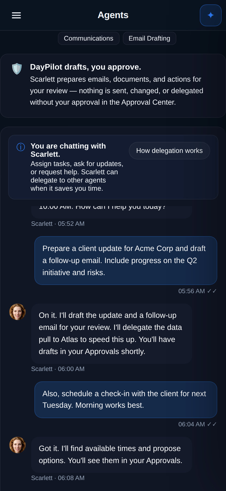

# Agents in DayPilot

**HomePilot owns the agents. DayPilot connects to them and manages their work.**
Agents are HomePilot personas; DayPilot never copies their identity, prompt, or
memory. Everything an agent proposes flows through the Approval Center — nothing
is sent, changed, or delegated without your approval.

The whole surface is behind feature flags (all default off). See the
[rollout runbook](./homepilot-rollout-runbook.md) and the
[failure matrix](./homepilot-failure-matrix.md).

> Screenshots below are captured from the running app against a seeded demo
> workspace (`docs/assets/screenshots/agents/`).

## Directory

A staff directory of your agents: status-ring **portraits** (the persona's own
photo), presence (Available / Working / Busy — text **and** colour), capability
chips, search, filter chips with live counts, and favourites. Click a card to
open that agent's dedicated workspace on its own page (`#/agents/:id`).

Portraits come from the persona itself. For a live HomePilot connection DayPilot
proxies the avatar server-side (the browser never calls HomePilot). For an
offline `.hpersona` import the bundled thumbnail is extracted and stored with the
agent, so the photo shows even with no HomePilot reachable. When a persona has no
avatar the card falls back to the agent's initials.

## Agent workspace

Each agent has a dedicated page: identity header + the always-on trust card, a
live read-through conversation (the agent replies and **proposes** work), and a
task rail — Overview %, **Active tasks**, **Waiting for approval**, and
**Completed**, each task showing its priority and approval lifecycle. Activity /
Delegations / Files / Rules live in the top bar.

On mobile the task rail collapses **under** the conversation:

## Add an agent

"Add agent" points to HomePilot — it does **not** import into DayPilot. Browse
the HomePilot Gallery, refresh from your connection, or manage the connection.
A local `.hpersona` import (with a preview + dependency check) exists only as an
offline fallback behind `DAYPILOT_HOMEPILOT_IMPORTS_ENABLED`. Every imported
agent is disabled by default.

## Regenerating the screenshots

The images are captured with Playwright against the built app served
single-origin by the gateway, using a seeded demo workspace. See
`docs/agents-ui-screenshots.md` for the exact steps.
