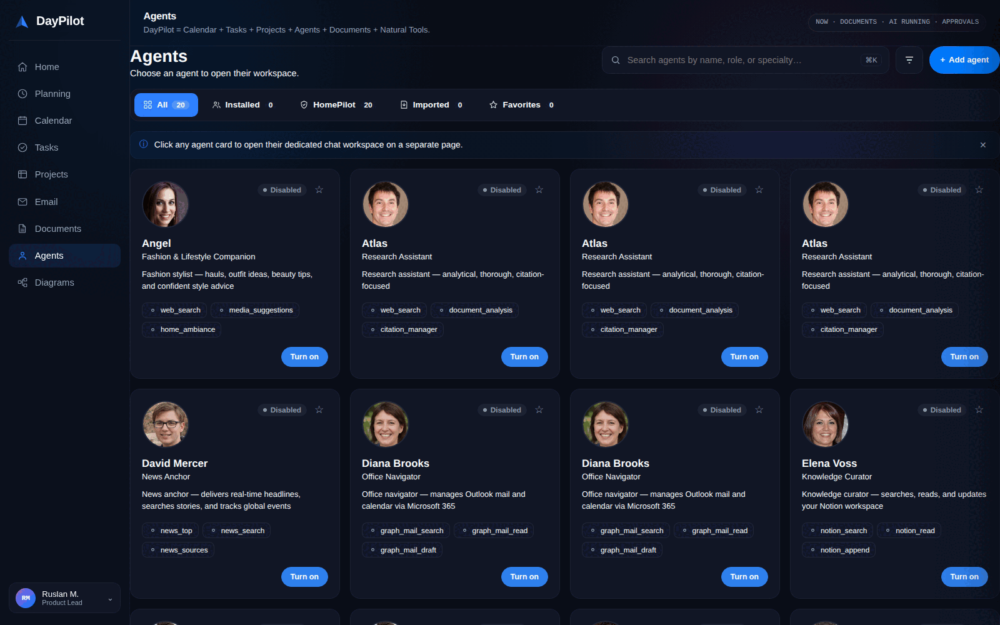
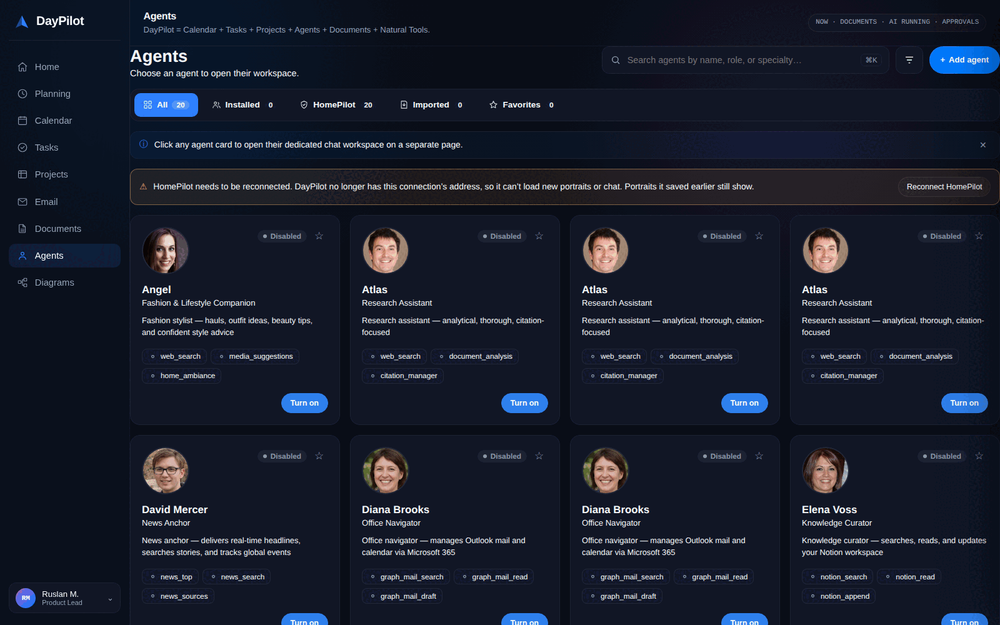
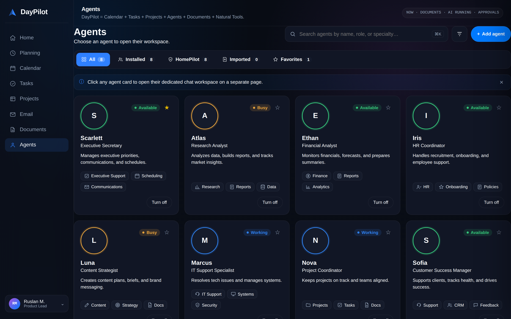
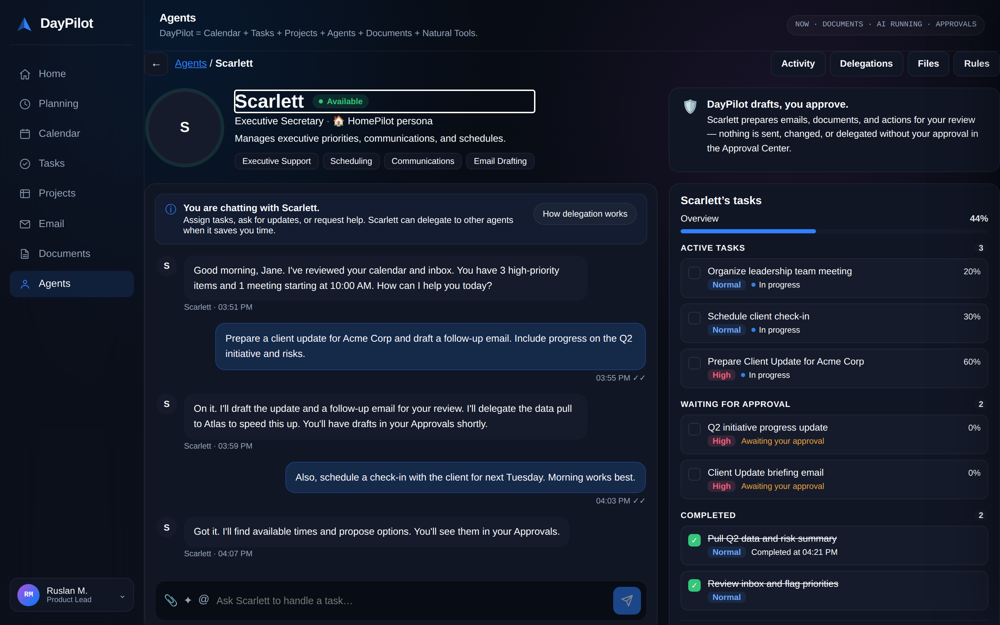
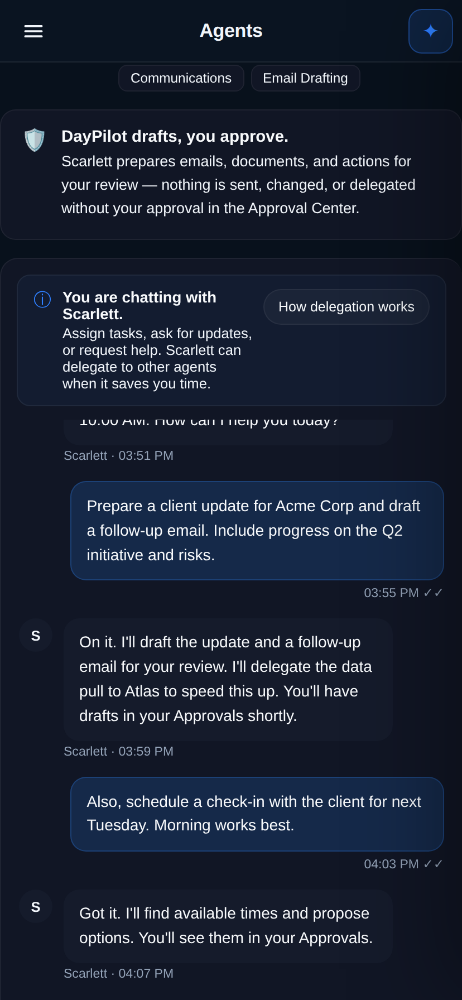
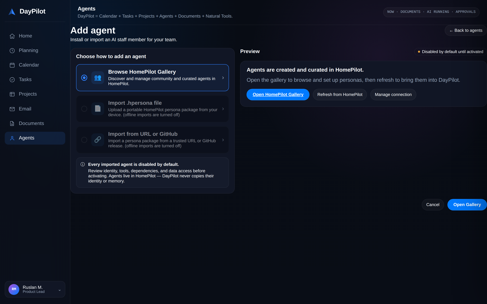

# Agents in DayPilot

**HomePilot owns the agents. DayPilot connects to them and manages their work.**
Agents are HomePilot personas; DayPilot never copies their identity, prompt, or
memory. Everything an agent proposes flows through the Approval Center — nothing
is sent, changed, or delegated without your approval.

The whole surface is behind feature flags (all default off). See the
[rollout runbook](./homepilot-rollout-runbook.md) and the
[failure matrix](./homepilot-failure-matrix.md).

> Screenshots below are captured from the running app against a seeded demo
> workspace (`docs/assets/screenshots/agents/`).

## Directory

A staff directory of your agents: status-ring **portraits** (the persona's own
photo), presence (Available / Working / Busy — text **and** colour), capability
chips, search, filter chips with live counts, and favourites. Click a card to
open that agent's dedicated workspace on its own page (`#/agents/:id`).

Portraits come from the persona itself. For a live HomePilot connection DayPilot
proxies the avatar server-side (the browser never calls HomePilot). For an
offline `.hpersona` import the bundled thumbnail is extracted and stored with the
agent, so the photo shows even with no HomePilot reachable. When a persona has no
avatar — or the portrait fails to load — the card falls back to the agent's
initials, never an empty circle. The proxy fetches from HomePilot's asset
origin (`/files/...` sits at the app root, not under the `/api` prefix) and
resolves gallery filenames inside the owning project's `persona/appearance`
directory, with a fallback for older files in flat uploads. Stored `/files/`
URLs are resolved against the current connection, including its proxy mount.
The configured HomePilot address, credentials and account binding survive
gateway restarts in DayPilot's private local credential store. Keep
`local_data/credentials` (or `DAYPILOT_CREDENTIALS_DIR`) with your local data.
If an older gateway already lost its in-memory configuration, reconnect once in
Settings → HomePilot; subsequent restarts retain it.

**Saved portraits.** Every portrait fetched from HomePilot is also kept in
DayPilot's private portrait folder (`local_data/agent-portraits`, or
`DAYPILOT_AGENT_PORTRAITS_DIR`; only real PNG, JPEG, WebP or GIF bytes are
kept), and each sync saves the ones not seen yet. When HomePilot is down, slow,
or the saved connection has lost its address, the last good copy is served
instead of a 404, so the directory keeps its faces. Response headers say what
happened: `X-Portrait-Source: live | saved | embedded`, or on a 404
`X-Portrait-Status: reconnect | unreachable | none`.

When the HomePilot connection can't be used, the Agents page says so above the
grid (reconnect, unreachable or rejected key) with a button to the HomePilot
settings, instead of leaving a page of initials unexplained.

The portrait URL carries a short version of the portrait reference (`&v=…`),
so a changed portrait is not hidden by the browser cache, while successful
portraits stay cacheable — a directory of dozens of agents is dozens of cache
hits rather than dozens of round trips.

When connecting, DayPilot checks that personas can actually be listed. Some
HomePilot installs answer the health check with a 404, so "reachable" alone did
not prove the address: `http://host:8000/api` against a backend serving
`/projects` at its root looked connected but listed nothing. If personas can
only be listed at the other form of the address (with or without `/api`), that
form is kept.

Portrait requests use the same configured gateway base as JSON requests
(`VITE_DAYPILOT_API_BASE`, `/api` by default), so they also work through Vite's
development proxy. Each portrait URL includes its workspace ID; image elements
cannot send the workspace header themselves. The directory, agent workspace,
chat and HomePilot setup wizard all use the same portrait component.

Synced agents arrive **disabled** on purpose — adding an agent to DayPilot is
a deliberate act, never a side effect of connecting HomePilot. Each card
carries the **Turn on / Turn off** button that performs it.

## Agent workspace

Each agent has a dedicated page: identity header + the always-on trust card, a
live read-through conversation (the agent replies and **proposes** work), and a
task rail — Overview %, **Active tasks**, **Waiting for approval**, and
**Completed**, each task showing its priority and approval lifecycle. Activity /
Delegations / Files / Rules live in the top bar.

On mobile the task rail collapses **under** the conversation:

## Add an agent

"Add agent" points to HomePilot — it does **not** import into DayPilot. Browse
the HomePilot Gallery, refresh from your connection, or manage the connection.
A local `.hpersona` import (with a preview + dependency check) exists only as an
offline fallback behind `DAYPILOT_HOMEPILOT_IMPORTS_ENABLED`. Every imported
agent is disabled by default.

## Regenerating the screenshots

The images are captured with Playwright against the built app served
single-origin by the gateway, using a seeded demo workspace. See
`docs/agents-ui-screenshots.md` for the exact steps.
