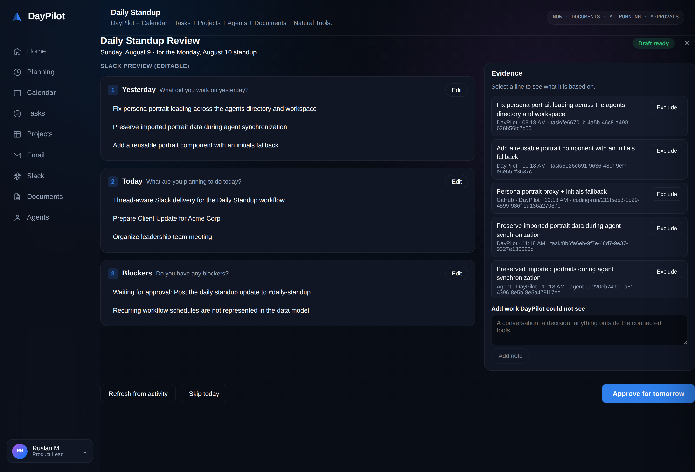
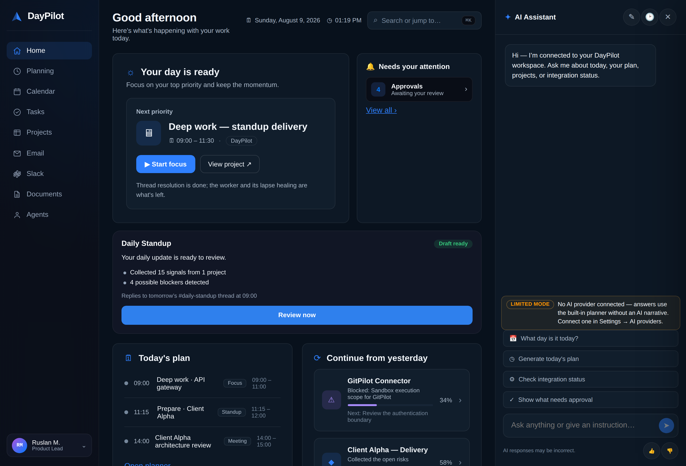
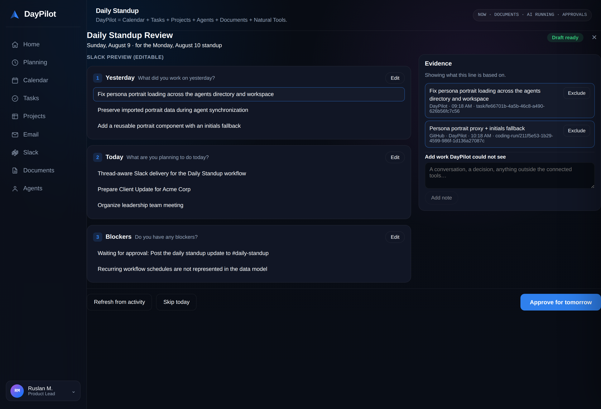
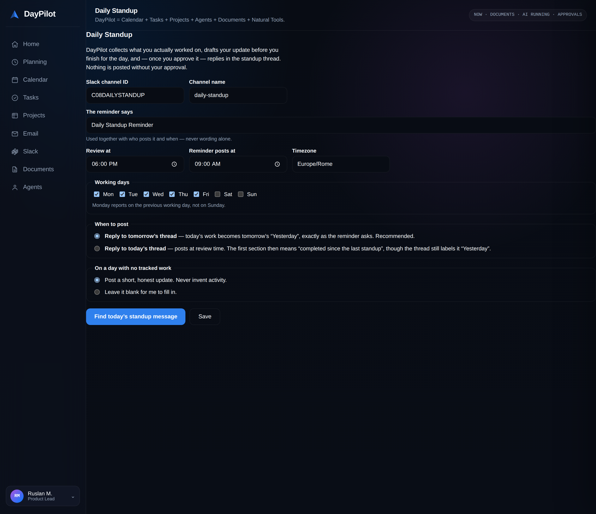
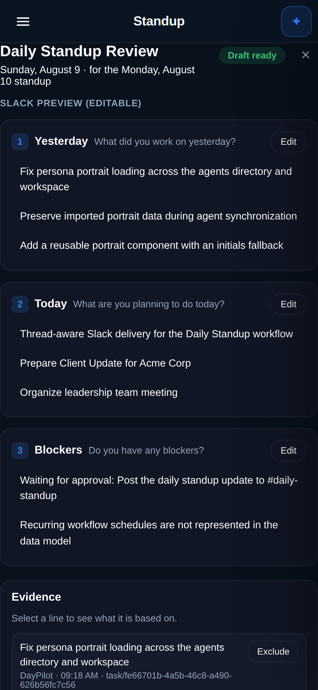

# Daily Standup Copilot

DayPilot watches the workday, drafts your standup update before you finish,
takes **one** review, and replies inside the right Slack thread.

The whole feature is built around a single rule: **never claim work that was not
observed, and never post text a human did not approve.** A standup goes into a
public channel under your name, so a bot that overstates progress is worse than
no bot at all.



---

## The daily rhythm

| Time | What happens |
|---|---|
| Through the day | Evidence is collected as it happens — tasks, plan blocks, coding runs, agent runs, approvals, meetings |
| ~17:30 | The Home card shows how much was collected and whether anything looks blocked |
| **18:00** | The draft opens for review. Three editable sections, evidence behind each line |
| On approval | The exact text is frozen and queued |
| **Next workday, 09:00** | DayPilot finds that morning's reminder and replies in its thread |

Wednesday's work becomes Thursday's **Yesterday**, which is what the reminder
literally asks for. A `same_day` mode posts at review time into the thread
opened that morning; the setup screen explains that its first section then means
*completed since the last standup*, even though the thread still says
"Yesterday".

The Home card tells you where the day stands before the review opens, so 18:00
is a confirmation rather than a surprise.



---

## What the draft is built from

Evidence rows, never prose. Each one points back at a real object, so the review
surface can answer "why does it say I did that?" for every bullet.

| Source | Signals |
|---|---|
| DayPilot | Tasks completed / started / blocked, plan blocks done or missed, pending approvals |
| GitHub | Coding runs, merged work, CI failures |
| Agents | Agent runs that succeeded, and ones that failed (a failure is a blocker) |
| Calendar | Meetings attended, tomorrow's fixed commitments |
| You | Notes for work that happened outside every connected tool |

Collection is idempotent: each signal carries a dedupe key derived from the
thing itself, so re-running the pass updates rows rather than double-counting
the day. **Excluding an item is yours and survives a regenerate** — you never
have to remove the same personal commit twice.

### How bullets are written

The compiler is deterministic. There is no model call in it, on purpose.

* Completion is only claimed when the source says completed. Anything still
  moving reads *"Continued work on …"*.
* Related evidence collapses into one outcome — a bullet per commit is a
  changelog, not a standup.
* Blockers come from observable signals only: a blocked task, a failed run, a
  pending approval. Otherwise the section says "None."
* Three bullets per section by default. More than that stops being read.
* A day with no tracked activity says so. It does not invent any.

A line DayPilot could not trace is labelled **Manual statement** or **Needs
confirmation** in the review, never blended in with observed work.

Select any line to see exactly what it is based on — source, time, and a
reference to the real object:



---

## Approval, and what it locks

Approving copies the three sections into an immutable snapshot and stores its
hash. Delivery reads only that snapshot and re-checks the hash before sending.

* Editing after approval **revokes** it and asks for a fresh one.
* Thread resolution never touches the approved content.
* One decision per day — there is no second prompt at 09:00.

`delivery_key` (`standup:<workflow>:<date>`) is the idempotency token, so a
retry after a Slack timeout targets the same logical post. A draft already
`SENT` reports the original message rather than posting again.

```
COLLECTING → DRAFT → NEEDS_REVIEW → APPROVED → WAITING_FOR_THREAD → SENDING → SENT
                                             ↘ THREAD_NOT_FOUND · SEND_FAILED · SKIPPED · EXPIRED
```

---

## Finding the thread

`chat.send` now carries `thread_ts`. Without it Slack posts a new root message —
for a standup that means shouting into the channel instead of answering the
reminder. **If no thread is found, nothing is posted at all.**

Two strategies:

* **own** — DayPilot posts the reminder and keeps the timestamp. Exact.
* **adopt** — somebody else's Slack workflow posts it. Matched on *three*
  signals together: the time window, the poster's bot identity, and the text
  signature. Any one alone is a bad bet to make daily in a public channel, so
  two must agree.

Setup's primary action is **Find today's standup message**, not Save: you
confirm the real message DayPilot will reply under, once, before it ever posts.



When resolution fails, the draft goes to `THREAD_NOT_FOUND` with the reason,
the Home card shows it, and **Retry now** is offered. A draft whose standup day
has passed expires rather than posting stale news.

---

## Running it unattended

Everything above describes what happens — **this is what makes it happen.**
The scheduler enqueues durable jobs, but a job nobody claims is a job that
never runs: without a worker the draft only appears when somebody opens the
page, and the next-morning reply never happens at all.

```bash
make standup-worker     # loop; drafts at 18:00, replies the next morning
make standup-once       # a single pass, for cron or a systemd timer
```

Two job kinds, both idempotent so a retry is always safe:

| Kind | When | What it does |
|---|---|---|
| `standup.review_due` | the review time | Collect evidence → build the draft → notify → **arm the next occurrence** |
| `standup.deliver` | the standup morning | Resolve the thread → post the approved snapshot, exactly once |

Three properties make it safe to leave alone:

* **The chain cannot break.** `review_due` arms the following day *before* it
  can fail on anything else. A workflow that errors once must not quietly stop
  running forever — that is how a user discovers a week later that their
  standup has been dead.
* **A lapse self-heals.** A deployment that was down over a review window would
  otherwise never schedule again, because the chain is self-perpetuating. The
  worker re-arms any lapsed schedule at start.
* **One job per occurrence.** Rescheduling cancels the previous pending review
  job, so an afternoon of settings edits does not mean several drafts tonight.

Delivery failures ride the queue's own bounded backoff. After the attempts are
spent the draft is left in a visible failure state with a **Retry now** the user
can press — never a silent dead-letter.

Run more than one worker if you like: claiming marks a job running, so a second
process picks up different work rather than repeating it.

---

## Timing

Everything is computed in the workflow's timezone and converted to naive UTC at
the boundary. 18:00 stays 18:00 across a daylight-saving change — the UTC hour
moves instead.

* Monday reports on **Friday**, by walking back over the configured working
  days, so a Tue–Sat week works too.
* The reporting window opens at the *previous workday's* 18:00, not at midnight,
  so work done at 19:30 is not silently dropped.
* Recurrence is one occurrence at a time: the job that runs schedules the next.
  No months of stale future jobs.

---

## Surfaces

| Where | Component |
|---|---|
| Settings → Integrations → Slack → Automations | `StandupSetup` |
| Home dashboard | `StandupStatusCard` |
| 18:00 review (`#/standup`) | `StandupReview` + `StandupPreview` + `EvidenceDrawer` |

All of them call `/v1/standup/*` on DayPilot's own gateway. The browser never
talks to Slack and never holds a Slack token.

The review collapses to one column on a phone, with approve leading — approving
from a phone at 18:05 is the common case, not the edge:



```
GET    /v1/standup/status                          Home card, in one call
GET    /v1/standup/workflows                       list
POST   /v1/standup/workflows                       create
PATCH  /v1/standup/workflows/{id}                  update
POST   /v1/standup/workflows/{id}/test-thread-resolution
POST   /v1/standup/workflows/{id}/collect
POST   /v1/standup/workflows/{id}/generate
POST   /v1/standup/workflows/{id}/notes            work DayPilot could not see
GET    /v1/standup/drafts/{date}
PATCH  /v1/standup/drafts/{id}
POST   /v1/standup/drafts/{id}/approve             freezes the snapshot
POST   /v1/standup/drafts/{id}/skip
POST   /v1/standup/drafts/{id}/send-now            the retry, same guarantees
GET    /v1/standup/drafts/{id}/evidence
POST   /v1/standup/drafts/{id}/evidence/{eid}/include|exclude
```

Every collection, edit, approval, send, retry and failure lands in the audit
stream and the event stream, reusing `Event`, `AuditLog`, `Approval` and `Job`
rather than duplicating them. When the draft is ready the user gets a
notification pointing at `#/standup` — which is why the review has its own
address.

---

## Example

> *1️⃣ Yesterday*
> • Fixed persona portrait loading by correcting HomePilot asset URL resolution.
> • Added a reusable portrait component with initials fallback.
>
> *2️⃣ Today*
> • Add thread-aware Slack delivery for the Daily Standup workflow.
> • Implement scheduled evidence collection and the 6:00 PM review.
>
> *3️⃣ Blockers*
> • Waiting for approval: post to Slack.

## Tests

`tests/test_standup_copilot.py` — 71 tests, written as the acceptance criteria:
evidence-backed claims, honest empty days, Monday's window, daylight saving,
thread matching (including refusing a reply mistaken for a root), approval
locking, exactly-once delivery, bounded retries, a full unattended day driven
through the worker, and the UI wired to live endpoints.
