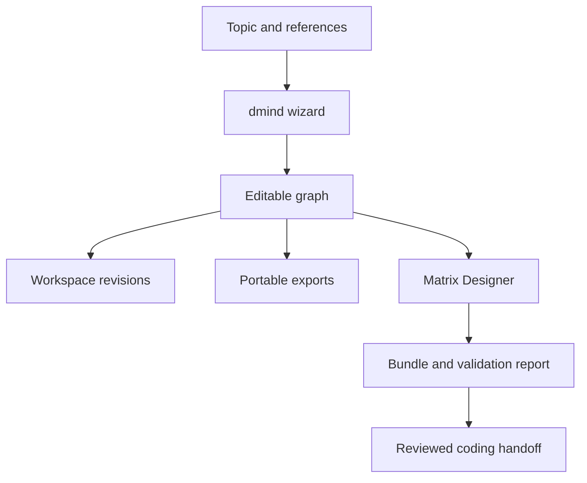

# dmind: complete development and delivery plan

## Product decision

**dmind** is DayPilot's diagram tool. Its navigation entry is **Diagrams**. Use dmind in feature names, generated artifacts, APIs and documentation. The supplied Xmind material is a capability reference, not a product name or a promise of native file compatibility. Existing third-party format names such as `.xmind` remain accurate where needed.

Goal: turn a topic, brainstorm, document or reference into a diagram that a person can inspect, edit, manage, export and share; use that graph to reason about flows and algorithms, then prepare a governed handoff to Matrix Designer, Claude Code or Codex.

This is additive. Existing calendar, tasks, projects, chat, documents, agents, email, Slack, approvals and coding workflows retain their routes, storage and behavior. Diagrams do not create tasks, run code, send messages or publish links by themselves.

## What the paired pull requests deliver

| Capability | Delivery in these PRs | Acceptance |
| --- | --- | --- |
| Branding and navigation | dmind product; desktop/mobile Diagrams tab and `#/diagrams`; command-palette navigation | Existing routes still typecheck and render |
| Simple wizard | Source → Structure → Review; topic, indented brainstorm, TXT/Markdown attachments, dmind JSON, Matrix Design Bundle JSON | Offline outline mode labels its generation honestly; preview requires user selection before replacing editor |
| Diagram kinds | Mind map, ordered flowchart, system graph | Branch hierarchy, directed flow, dependency, relationship and labeled feedback loops remain distinct |
| Rendering/editing | SVG canvas; drag positions; pan by dragging background; zoom; auto-layout; accessible outline; labels and notes; add child/sibling; remove branch; expand/collapse; labeled links | Rendering never interprets user text as HTML; complete graph exports include folded nodes |
| Management | Workspace list; explicit save/save copy; archive/unarchive; 50-step in-memory undo/redo; persistent revisions; restore to draft; browser draft recovery | Restore appends on save, never rewrites an old revision; stale saves return 409 |
| Export/share | dmind JSON, Markdown, Mermaid, SVG, script-free self-contained read-only HTML, browser print-to-PDF | JSON retains graph metadata; HTML requires no service or remote assets |
| Coding handoff | Markdown brief for Claude Code/Codex with graph, flow and acceptance checklist | Source text is marked untrusted reference data; no auto-execution |
| Matrix compatibility | Shared dmind/v1 schema/fixture; bundle → graph; graph → newly designed and validated bundle; HTTP, MCP and CLI | Original bundle preserved separately; edited graph never inherits a previous approval |
| Verification | Producer/consumer tests, malformed input/size limits, persistence/CAS/history, roles/workspaces, safe exports, 1000-node pure graph smoke | Existing suites run; unrelated baseline failures recorded honestly |

These PRs are the first usable increment of the full plan. PDF/image/OCR/URL ingestion, native `.xmind`/OPML support, additional layouts, rich markers/media, hosted ACL sharing, collaborative editing, semantic AI graph refinement and comprehensive performance/accessibility certification are scheduled below. There is no claim of complete Xmind feature parity.

## User journey and wizard design

1. **Source.** Type a topic; optionally paste brainstorm lines or attach text. Indentation creates branch hierarchy. JSON import creates a copy with a new identity. Never silently overwrite a saved diagram. A topic alone creates an editable central node; it is not advertised as AI brainstorming.
2. **Structure.** Choose mind map, flowchart or system. Local outline mode is the default. Flowcharts initially connect steps in order; the editor lets the user add conditions and loops. Optional Matrix Designer mode sends source text to the configured provider and returns actual batch/dependency proposals. It does not pretend that all providers are available.
3. **Review.** Inspect proposed topics and diagram kind. Go back to revise input or accept the preview into an unsaved draft. AI proposals must remain separate from saved revisions.
4. **Refine.** Rename topics, add notes, branches and labeled links. Notes can express algorithm inputs/outputs, invariants, failure handling, retries and termination conditions. Feedback detection is structural, not proof of correctness.
5. **Manage.** Save explicitly; reopen from the workspace list. Undo/redo affects the current edit session. Revision history survives reload. Restoring an old version creates a new draft and saving appends a new version. Archive retains all history.
6. **Export/share.** Choose portable JSON for editable interchange; Markdown/Mermaid for repositories; SVG for visuals; HTML for a read-only snapshot and print-to-PDF. Sharing an export is an explicit action by the person. The initial release has no anonymous public URLs or live collaboration.
7. **Build preparation.** Export a coding brief or request a fresh Matrix Design Bundle. Review validation, batch dependencies, allowed files, `must_not_change`, acceptance tests and unresolved decisions. Use DayPilot's existing governed build chain only after that separate review.

## Architecture and exact integration seams

| Concern | DayPilot | Matrix Designer |
| --- | --- | --- |
| UI | `packages/ui-bridge/src/diagrams/` | No competing UI is added |
| Shell | `minimalPortal.tsx`, `shell/route.ts` | Existing service interfaces retained |
| Contract | `packages/dmind-contract/dmind.schema.json`, golden fixture | Packaged `_data/schemas/dmind.schema.json`, same golden fixture |
| Semantic validation | `daypilot_orchestrator/design/dmind_contract.py` | `matrix_designer/dmind_contract.py` |
| Storage | Shared SQLAlchemy `Diagram`, `DiagramRevision`; migration `0024_dmind_diagrams` | Stateless conversion; artifacts returned to callers |
| Gateway | `/v1/diagrams` resource family | `/design/diagrams`, `/design/diagrams/import-bundle`, `/design/diagrams/bundle` |
| Model use | Existing Matrix Designer connection and API-key handling | Existing `bundle_handler`, provider guard and independent `verdict` |
| Agent tools | Portable brief for existing coders | MCP `generate_diagram`, `design_from_diagram`; CLI `diagram`, `diagram-bundle` |

Local outline generation is a deterministic parser, not an LLM. The initial renderer uses SVG without adding runtime dependencies. Benchmark evidence must determine when to introduce virtualization or canvas rendering; do not promise 60fps for all 1000-node documents just because validation allows 1000 nodes.

## Canonical document and graph semantics

- `schema_version: "dmind/v1"` identifies the document format; it is independent of the persisted save revision.
- `id`, `title`, `kind`, flat `nodes`, typed `edges` and `metadata` make up a document. Node IDs and edge IDs must be unique safe identifiers within their own sets. Links must reference existing nodes.
- Nodes carry `label`, plain-text `notes`, optional `position`, `collapsed` and extensible metadata. Folded nodes remain part of the document.
- `branch` edges describe a forest: at most one parent per target; cycles forbidden. `flow`, `dependency` and `relationship` can represent loops. A coding handoff must explicitly review dependency cycles and termination/retry policies.
- Matrix batches map to topic nodes with their original batch metadata. Dependencies map from prerequisite to dependent. The untouched original Design Bundle is preserved in metadata for separate export.
- Unknown metadata is retained by import/save/export. Native-format information that cannot be represented in v1 must later be retained in an opaque format-specific sidecar and reported, never silently dropped.
- Limits: 2 MB encoded UTF-8 JSON; 1–1000 nodes; 4000 edges; label 500 characters; notes 20000; source outline 100000. Over-limit inputs are rejected with an actionable error; they are not silently truncated into a different diagram.
- Current workspace list returns the most recent 200 entries; history returns the most recent 100 snapshots. Cursor pagination is a Phase 2 task; snapshots beyond this window remain stored.

## API contracts

### DayPilot

- `GET /v1/diagrams`: workspace summaries, including archived flag.
- `POST /v1/diagrams {document}`: validate and create a copy; server assigns ID; response `{id, revision, archived, document}`.
- `GET /v1/diagrams/{id}`: load only within the caller's workspace.
- `PUT /v1/diagrams/{id} {document, expectedRevision, archived}`: atomic compare-and-swap; mismatch is `409`; successful save adds a snapshot in the same transaction.
- `GET /v1/diagrams/{id}/revisions`: retained immutable document snapshots.
- `POST /v1/diagrams/generate {topic, content, kind, useDesigner, candidateId}`: upstream proposal; never saved automatically.
- `POST /v1/diagrams/design-bundle {document, candidateId}`: newly proposed bundle plus validation report; no intake side effects.

Workspace selection uses the existing `X-Workspace-Id` convention. Cookie sessions require workspace membership and CSRF on writes. Token mode applies role gates and restricts the header to the principal's workspace. Local single-user mode keeps its existing owner behavior. Unknown/cross-workspace IDs return 404. Provider failure is explicit, including an actionable error if the companion dmind endpoints are not installed.

### Matrix Designer

- `POST /design/diagrams {topic, content, kind, use_designer, candidate_id}` returns `{diagram, mode}`. Local mode avoids providers; designer mode follows the configured provider guard.
- `POST /design/diagrams/import-bundle {bundle}` validates the bundle schema and visualizes batches while retaining the original.
- `POST /design/diagrams/bundle {diagram, candidate_id}` returns `{bundle, validation, source_diagram_id, source_digest}`. The full edited graph becomes an untrusted text reference, and a fresh bundle is generated. The schema/rule verdict is recomputed; diagram metadata is never an approval authority.
- Existing API-key protection wraps all new endpoints. MCP and CLI call the same core functions.
- The UI downloads the **raw** `matrix.designer.bundle/v1` document for existing importers and offers its report separately. HTTP/MCP envelopes are not themselves Design Bundle files.

## Phased development backlog

Estimates are planning ranges for two engineers plus part-time design/QA, not delivery commitments. Each phase is independently reviewable and deployable; later phases require acceptance evidence from earlier phases.

| Phase | Estimate | Scope and deliverables | Release gate |
| --- | --- | --- | --- |
| 0 — Paired usable foundation | Delivered in these PRs | Contract, wizard, editor, revisions, exports, Matrix handoff, tests and this plan | Typecheck/build, contract tests and documented regression results |
| 1 — Input intelligence | 2–3 weeks | Safe PDF/DOCX text extraction; OCR/images; approved document references; URL fetching with SSRF/private-network defenses, redirect/byte/time limits; source provenance and extraction preview | Corpus coverage, malformed-file tests, source cites on generated topics; provider/data disclosure before sending |
| 2 — Reliable graph workspace | 2–3 weeks | IndexedDB multi-draft store with account/workspace isolation; autosave queue and retries; durable conflict copies; pagination; project association; search/tags; revision metadata/diffs | Offline/reconnect/multi-tab E2E tests; no lost edits; 200+ list and 100+ revision paging |
| 3 — Layout and rich editing | 3–4 weeks | Radial mind map, tree, org chart, fishbone, grid; layout workers; multi-select; drag-reparent; branch validation; context menus; marker/theme palette; notes, safe links, images and attachments; synchronized outline editing | Keyboard and pointer parity; no branch cycles; importer metadata retained; responsive/touch acceptance |
| 4 — Native interchange | 3–4 weeks | `.xmind` classic ZIP/XML and modern ZIP/JSON detection; OPML; import/export fidelity reports; attachment manifests; migration adapters; unsupported-field sidecars | Real fixture corpus from both format families; bounded ZIP/XML handling; reopened exports preserve supported topology/notes/media and report losses |
| 5 — AI refinement and algorithm analysis | 3–4 weeks | Propose expand/explain/reorganize/refine patches against a base revision; semantic diff preview; explicit apply/reject; branching questions; algorithm inputs/outputs/invariants/complexity; reachability, dead ends, SCCs, dependency ordering, retries and tests | Patches never auto-apply; schema validated; source provenance retained; solver results separated from model suggestions |
| 6 — Sharing and collaboration | 3–4 weeks | Workspace/member ACLs, read-only share links, expiration/revocation, export redaction preview, audit trail; comment threads; opt-in CRDT collaboration | Permission/revocation/tenant isolation tests; read-only cannot mutate; signed attachment URLs expire; no public sharing default |
| 7 — Coder integration and production hardening | 2–3 weeks | Node-to-requirement IDs; matrix architecture/contracts/batch scope; approved bundle intake; adapter handoff to Claude Code/Codex; code-to-diagram trace links; performance/accessibility/security certification | Allowed-file and acceptance checks; human review before execution; provider outage/fallback tests; zero cross-feature regressions |
| 8 — Optional presentation/product parity | separately scoped | Audio-to-map, drawing recognition, task/WBS/Gantt conversion, stickers, image generation, pitch/presentation export | Only after core graph/storage/interchange gates; each capability has an explicit privacy and cost review |

Sequence: 1 and 2 can proceed together after Phase 0; Phase 3 precedes native export visual fidelity; Phase 5 needs reliable revisions; Phase 6 needs storage/ACL hardening; Phase 7 uses the complete governed contract. Total baseline effort is roughly 18–25 engineering weeks, with overlap possible; optional parity is excluded. Re-estimate after extraction and native-format spikes.

## Detailed build batches and ownership

| Batch | Owner | Allowed area | Depends on | Acceptance and validation |
| --- | --- | --- | --- | --- |
| D01 Contract | Integration engineer | Both dmind schema/validator/fixture directories | None | Same fixture validates in Python/TS; limits and semantic failures covered |
| D02 Persistence | Backend engineer | DayPilot models, migration, diagrams router/tests | D01 | SQLite/Postgres migration works; CAS conflict and restore append tests; membership/role/CSRF checks |
| D03 Wizard and shell | Frontend engineer + design | DayPilot diagrams UI, shell route/navigation | D01 | Topic/attachment/brainstorm modes; honest offline behavior; preview gate; desktop/mobile navigation |
| D04 Editor and exports | Frontend engineer | dmind canvas/model/serializers/tests | D03 | Undo/redo, node/branch/link editing, collapse and safe complete exports |
| D05 Matrix bridge | Integration engineer | Matrix dmind/service/MCP/CLI and DayPilot diagrams bridge | D01 | Exact schema, batch metadata/dependency preservation, new verdict and digest; old routes unchanged |
| D06 Extraction | Backend + integration | New input adapters, provenance, request limits | D03 | Preview and provenance; no automatic URL fetch or unbounded parsing |
| D07 Refinement | Integration + frontend | Patch protocol, editor diff/review | D02,D05 | Apply against expected revision; reject stale/invalid patch; previous graph retained |
| D08 Rich layouts/interchange | Frontend + integration | Layout workers, format adapters, safe media | D04,D06 | Fixtures, fidelity reports, performance profile and keyboard interaction |
| D09 Share/team | Backend + frontend | Diagram ACL/share resources and UI | D02,D08 | Grant/revoke/expire/read-only isolation; explicit publish action |
| D10 Coder workflow | Integration engineer | Existing design/coding adapters with additive dmind references | D05,D07 | No auto-run; review status and file scope respected; graph-source hashes retained |
| D11 Release QA | QA + maintainers | Tests/CI/docs, no unrelated production logic | All selected release batches | Regression, security, accessibility, performance, deployment/rollback evidence |

## Verification strategy and measurable gates

- **Graph contract:** malformed types, versions, IDs, dangling edges, branch cycles, multiple parents, non-finite positions, labels/notes/bytes/node/edge limits; feedback loops valid; unknown metadata round-trips.
- **Persistence:** create/save/reopen; stale revisions rejected; edits during pending requests cannot overwrite local drafts; archive and recovery; workspace and account isolation; concurrent clients; rollback leaves no partial snapshot.
- **Interchange:** shared golden graph in both repos; Matrix bundle batch IDs/acceptance/allowed files/dependencies retained; original download distinct from newly proposed bundle; verdict and digest recomputed; never copy an approval from diagram metadata.
- **Exports:** hostile labels/notes/conditions escaped in SVG/HTML/Mermaid; no executable scripts, remote resources or HTML notes; complete graph retained when collapsed; coding brief marks source as untrusted.
- **UI:** wizard back/next/review; file validation; restore/undo/redo; pointer drag/pan/zoom; keyboard outline; narrow layout; unavailable gateway/designer clearly reported; saved-state conflict flow.
- **Performance:** synthetic balanced/deep/feedback graphs at 100/500/1000 nodes, measured on documented hardware/browser. Target p95 edit <100 ms and steady pan/zoom >=45fps at 1000 nodes; measure before promising. Target import <2s for bounded native files. Implement offscreen culling/workers if evidence requires it.
- **Accessibility:** WCAG 2.2 AA review, axe, focus order/visible focus, keyboard node creation/selection/deletion/folding, screen-reader outline and status, reduced motion, light/dark contrast; Chrome/Firefox/WebKit and touch testing.
- **Regression:** existing suites on both repositories, TypeScript workspace typechecks/builds and existing UI smoke. Record pre-existing failures with a clean baseline comparison instead of changing unrelated features.

## Security, privacy and operation

Treat all attachments, labels, links, notes and model output as untrusted content. Plain text is escaped; no code execution, arbitrary HTML or remote URL fetch is introduced. Bound encoded JSON, source size and graph cardinality. Server-side upload parsers later need compressed/uncompressed ZIP limits, entry count, path traversal protection and XML entity rejection. No arbitrary filesystem paths from imported documents.

Browser draft recovery is scoped to account/workspace and stores local unencrypted work; shared-machine deployments should disable it or clear drafts at sign-out as part of Phase 2. Draft history is bounded to 50 actions. Explicit save failures leave the draft/export workflow available.

Provider-backed generation and handoff send the selected text/graph through the existing configured connection. The wizard states this before use. Provider credentials stay on the server. AI output remains a proposal; generation is not correctness verification or permission to execute.

Migration creates only two new tables. Existing data is untouched. Deploy Matrix Designer's endpoints first, then DayPilot's migration/backend and matching web assets. A missing companion update produces an explicit gateway error while the local editor still works. Rollback application code leaves the new data intact; do not run destructive migration downgrade on a database containing user diagrams. Back up/export before an intentional table removal.

## Definition of done

For each phase: implemented user journey, documented API/schema, meaningful automated checks, reviewer-visible limitations, appropriate UI/accessibility/performance evidence, migration/rollback notes, no unexpected writes to existing tasks or code, and reviewable pull request. Phase 0 is usable independently; full native/interchange/collaboration parity is complete only when its later release gates pass.
