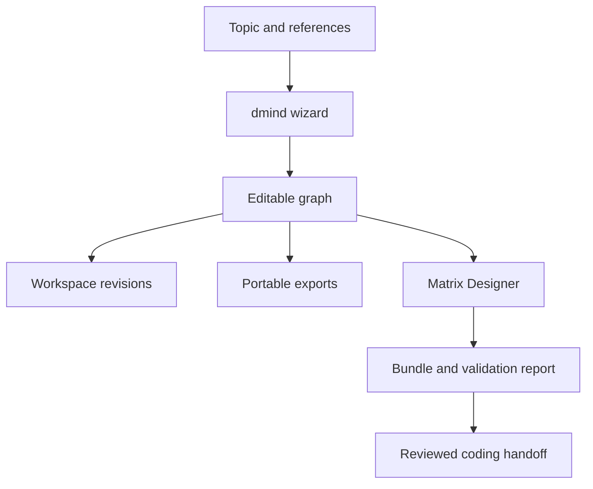

# dmind: complete development and delivery plan

## Product decision

**dmind** is DayPilot's diagram tool. Its navigation entry is **Diagrams**. Use dmind in feature names, generated artifacts, APIs and documentation. The native file format is **`.dmind`** (see below). Other tools' formats are not targets: Xmind was a capability reference only, and the only planned use of third-party formats such as `.xmind` or OPML is an optional, import-only adapter (batch B10) that reports what it could not carry over.

Goal: turn a topic, brainstorm, document or reference into a diagram that a person can inspect, edit, manage, export and share; use that graph to reason about flows and algorithms, then prepare a governed handoff to Matrix Designer, Claude Code or Codex.

This is additive. Existing calendar, tasks, projects, chat, documents, agents, email, Slack, approvals and coding workflows retain their routes, storage and behavior. Diagrams do not create tasks, run code, send messages or publish links by themselves.

## What the paired pull requests deliver

| Capability | Delivery in these PRs | Acceptance |
| --- | --- | --- |
| Branding and navigation | dmind product; desktop/mobile Diagrams tab and `#/diagrams`; command-palette navigation | Existing routes still typecheck and render |
| Simple wizard | Source → Structure → Review; topic, indented brainstorm, TXT/Markdown attachments, dmind JSON, Matrix Design Bundle JSON | Offline outline mode labels its generation honestly; preview requires user selection before replacing editor |
| Diagram kinds | Mind map, ordered flowchart, system graph | Branch hierarchy, directed flow, dependency, relationship and labeled feedback loops remain distinct |
| Rendering/editing | SVG canvas; drag positions; pan by dragging background; zoom; auto-layout; accessible outline; labels and notes; add child/sibling; remove branch; expand/collapse; labeled links | Rendering never interprets user text as HTML; complete graph exports include folded nodes |
| Management | Workspace list; explicit save/save copy; archive/unarchive; 50-step in-memory undo/redo; persistent revisions; restore to draft; browser draft recovery | Restore appends on save, never rewrites an old revision; stale saves return 409 |
| Export/share | dmind JSON, Markdown, Mermaid, SVG, script-free self-contained read-only HTML, browser print-to-PDF | JSON retains graph metadata; HTML requires no service or remote assets |
| Coding handoff | Markdown brief for Claude Code/Codex with graph, flow and acceptance checklist | Source text is marked untrusted reference data; no auto-execution |
| Matrix compatibility | Shared dmind/v1 schema/fixture; bundle → graph; graph → newly designed and validated bundle; HTTP, MCP and CLI | Original bundle preserved separately; edited graph never inherits a previous approval |
| Verification | Producer/consumer tests, malformed input/size limits, persistence/CAS/history, roles/workspaces, safe exports, 1000-node pure graph smoke | Existing suites run; unrelated baseline failures recorded honestly |

B0 is the first usable increment of the full plan. PDF/image/OCR/URL ingestion, the `.dmind` file and bundle forms, additional layouts, rich markers/media, hosted ACL sharing, collaborative editing, semantic AI graph refinement and comprehensive performance/accessibility certification are scheduled in the batch plan below. There is no claim of feature parity with any other diagram tool.

## User journey and wizard design

1. **Source.** Type a topic; optionally paste brainstorm lines or attach text. Indentation creates branch hierarchy. JSON import creates a copy with a new identity. Never silently overwrite a saved diagram. A topic alone creates an editable central node; it is not advertised as AI brainstorming.
2. **Structure.** Choose mind map, flowchart or system. Local outline mode is the default. Flowcharts initially connect steps in order; the editor lets the user add conditions and loops. Optional Matrix Designer mode sends source text to the configured provider and returns actual batch/dependency proposals. It does not pretend that all providers are available.
3. **Review.** Inspect proposed topics and diagram kind. Go back to revise input or accept the preview into an unsaved draft. AI proposals must remain separate from saved revisions.
4. **Refine.** Rename topics, add notes, branches and labeled links. Notes can express algorithm inputs/outputs, invariants, failure handling, retries and termination conditions. Feedback detection is structural, not proof of correctness.
5. **Manage.** Save explicitly; reopen from the workspace list. Undo/redo affects the current edit session. Revision history survives reload. Restoring an old version creates a new draft and saving appends a new version. Archive retains all history.
6. **Export/share.** Choose portable JSON for editable interchange; Markdown/Mermaid for repositories; SVG for visuals; HTML for a read-only snapshot and print-to-PDF. Sharing an export is an explicit action by the person. The initial release has no anonymous public URLs or live collaboration.
7. **Build preparation.** Export a coding brief or request a fresh Matrix Design Bundle. Review validation, batch dependencies, allowed files, `must_not_change`, acceptance tests and unresolved decisions. Use DayPilot's existing governed build chain only after that separate review.

## Architecture and exact integration seams

| Concern | DayPilot | Matrix Designer |
| --- | --- | --- |
| UI | `packages/ui-bridge/src/diagrams/` | No competing UI is added |
| Shell | `minimalPortal.tsx`, `shell/route.ts` | Existing service interfaces retained |
| Contract | `packages/dmind-contract/dmind.schema.json`, golden fixture | Packaged `_data/schemas/dmind.schema.json`, same golden fixture |
| Semantic validation | `daypilot_orchestrator/design/dmind_contract.py` | `matrix_designer/dmind_contract.py` |
| Storage | Shared SQLAlchemy `Diagram`, `DiagramRevision`; migration `0024_dmind_diagrams` | Stateless conversion; artifacts returned to callers |
| Gateway | `/v1/diagrams` resource family | `/design/diagrams`, `/design/diagrams/import-bundle`, `/design/diagrams/bundle` |
| Model use | Existing Matrix Designer connection and API-key handling | Existing `bundle_handler`, provider guard and independent `verdict` |
| Agent tools | Portable brief for existing coders | MCP `generate_diagram`, `design_from_diagram`; CLI `diagram`, `diagram-bundle` |

Local outline generation is a deterministic parser, not an LLM. The initial renderer uses SVG without adding runtime dependencies. Benchmark evidence must determine when to introduce virtualization or canvas rendering; do not promise 60fps for all 1000-node documents just because validation allows 1000 nodes.

## Canonical document and graph semantics

- `schema_version: "dmind/v1"` identifies the document format; it is independent of the persisted save revision.
- `id`, `title`, `kind`, flat `nodes`, typed `edges` and `metadata` make up a document. Node IDs and edge IDs must be unique safe identifiers within their own sets. Links must reference existing nodes.
- Nodes carry `label`, plain-text `notes`, optional `position`, `collapsed` and extensible metadata. Folded nodes remain part of the document.
- `branch` edges describe a forest: at most one parent per target; cycles forbidden. `flow`, `dependency` and `relationship` can represent loops. A coding handoff must explicitly review dependency cycles and termination/retry policies.
- Matrix batches map to topic nodes with their original batch metadata. Dependencies map from prerequisite to dependent. The untouched original Design Bundle is preserved in metadata for separate export.
- Unknown metadata is retained by import/save/export. Native-format information that cannot be represented in v1 must later be retained in an opaque format-specific sidecar and reported, never silently dropped.
- Limits: 2 MB encoded UTF-8 JSON; 1–1000 nodes; 4000 edges; label 500 characters; notes 20000; source outline 100000. Over-limit inputs are rejected with an actionable error; they are not silently truncated into a different diagram.
- Current workspace list returns the most recent 200 entries; history returns the most recent 100 snapshots. Cursor pagination is a B2 task; snapshots beyond this window remain stored.

## API contracts

### DayPilot

- `GET /v1/diagrams`: workspace summaries, including archived flag.
- `POST /v1/diagrams {document}`: validate and create a copy; server assigns ID; response `{id, revision, archived, document}`.
- `GET /v1/diagrams/{id}`: load only within the caller's workspace.
- `PUT /v1/diagrams/{id} {document, expectedRevision, archived}`: atomic compare-and-swap; mismatch is `409`; successful save adds a snapshot in the same transaction.
- `GET /v1/diagrams/{id}/revisions`: retained immutable document snapshots.
- `POST /v1/diagrams/generate {topic, content, kind, useDesigner, candidateId}`: upstream proposal; never saved automatically.
- `POST /v1/diagrams/design-bundle {document, candidateId}`: newly proposed bundle plus validation report; no intake side effects.

Workspace selection uses the existing `X-Workspace-Id` convention. Cookie sessions require workspace membership and CSRF on writes. Token mode applies role gates and restricts the header to the principal's workspace. Local single-user mode keeps its existing owner behavior. Unknown/cross-workspace IDs return 404. Provider failure is explicit, including an actionable error if the companion dmind endpoints are not installed.

### Matrix Designer

- `POST /design/diagrams {topic, content, kind, use_designer, candidate_id}` returns `{diagram, mode}`. Local mode avoids providers; designer mode follows the configured provider guard.
- `POST /design/diagrams/import-bundle {bundle}` validates the bundle schema and visualizes batches while retaining the original.
- `POST /design/diagrams/bundle {diagram, candidate_id}` returns `{bundle, validation, source_diagram_id, source_digest}`. The full edited graph becomes an untrusted text reference, and a fresh bundle is generated. The schema/rule verdict is recomputed; diagram metadata is never an approval authority.
- Existing API-key protection wraps all new endpoints. MCP and CLI call the same core functions.
- The UI downloads the **raw** `matrix.designer.bundle/v1` document for existing importers and offers its report separately. HTTP/MCP envelopes are not themselves Design Bundle files.

## The `.dmind` file

| Item | Decision |
| --- | --- |
| Extension and MIME | `.dmind`, `application/vnd.dmind+json` |
| Content (B1) | Plain UTF-8 JSON in the `dmind/v1` schema: readable, diff-friendly, git-friendly. B0 already exports the same JSON as "dmind JSON" (`<title>.dmind.json`). |
| Container (B5) | When images or attachments arrive, `.dmind` may be a ZIP with `document.json`, `manifest.json` (hashes and sizes) and `assets/`. Readers detect the form from the first bytes: `{` is JSON, `PK` is ZIP. Both open and re-save as the right form; old files always open. |
| Safety | ZIP limits on entry count, compressed and expanded size, path traversal and symlinks. Notes stay plain text; nothing is executed. |
| Unknown data | Unknown metadata round-trips. Anything a reader cannot represent is kept and reported, never dropped. |
| Opening a file | Always creates a new copy; it never overwrites a saved diagram. |

## Simple usage

1. Open **Diagrams** and choose **New diagram**.
2. In the wizard type a topic (optionally an outline or an attached text file), pick Mind map, Flowchart or System, and review the preview.
3. Edit the diagram, then **Save**.
4. **Export** as dmind JSON (the `.dmind` file from B1), Markdown, Mermaid, SVG, read-only HTML or PDF (print the HTML).
5. **Import a copy** accepts a dmind file or a Matrix Design Bundle; it always creates a new draft.
6. **Generate Design Bundle** or the coding brief prepares a handoff. Nothing runs, and a separate review comes first.

## Delivery batches

Each batch is independently reviewable and deployable. A batch starts only when the previous gate has evidence. Estimates are planning ranges for two engineers plus part-time design/QA, not commitments.

| Batch | Estimate | Delivers | Touches | Gate |
| --- | --- | --- | --- | --- |
| **B0 Foundation** | delivered (merged, then hardened on `claude/dmind-b0-foundation`) | Contract, wizard, SVG editor, undo/redo, revisions, exports, Matrix bridge | `diagrams/`, `dmind-contract`, migration 0024, `/v1/diagrams`, `/design/diagrams*` | Typecheck and build pass, contract tests pass, baseline recorded (below) |
| **B1 `.dmind` file** | 1 week | Export and open `.dmind` (JSON form), drag-and-drop, schema-version check, an "unknown fields kept" notice | `diagrams/` serializers, shared fixture | Lossless round trip including unknown metadata; oversize and malformed files rejected with clear errors |
| **B2 Reliable workspace** | 2-3 weeks | IndexedDB drafts per account and workspace, autosave with retry, conflict copies, cursor pagination, search/tags, project link, revision diffs | `diagrams/`, router | Offline, reconnect and multi-tab tests lose no edits; 200+ diagrams and 100+ revisions page correctly; drafts cleared on sign-out where configured |
| **B3 Inputs** | 2-3 weeks | PDF/DOCX text, OCR, URL fetch with SSRF defenses, provenance on topics, preview before use | New input adapters only | Corpus and malformed-file tests; nothing fetched or sent without disclosure |
| **B4 Layouts and rich editing** | 3-4 weeks | Radial, tree, org chart, fishbone and grid layouts; multi-select, drag-reparent, context menus, markers and themes, safe links, synchronized outline | `diagrams/` | Keyboard and pointer parity; no branch cycles; 1000-node benchmark recorded |
| **B5 `.dmind` bundle** | 2 weeks | ZIP container, images and attachments, bounded extraction | Serializers, asset store | ZIP-bomb, traversal and symlink tests; JSON and ZIP forms reopen identically |
| **B6 AI refinement and analysis** | 3-4 weeks | Patch proposals with visible diff and explicit apply; reachability, dead ends, SCCs, dependency order, retry and termination checks | Patch protocol, editor review, Matrix bridge | Patches apply only against the expected revision; stale or invalid ones rejected; solver results labeled apart from model suggestions |
| **B7 Sharing** | 3-4 weeks | Workspace ACLs, read-only expiring links, redaction preview, audit trail, comments | New ACL resources | Revoke, expiry and tenant isolation tests; read-only cannot mutate; nothing shared by default |
| **B8 Coder handoff** | 2-3 weeks | Node-to-requirement IDs, bundle intake, adapter to Claude Code or Codex, trace links | Existing design adapters, additively | Allowed-file and acceptance checks; human review before execution |
| **B9 Hardening** | 2 weeks | Performance, WCAG 2.2 AA, security and cross-browser certification, rollback evidence | Tests, CI and docs only | Documented hardware benchmarks, axe plus manual review, zero regressions in existing suites |
| **B10 Optional import** | 2 weeks | Import-only third-party adapter (Xmind, OPML) with a fidelity report | Adapter only | Real fixtures reopen with topology and notes intact; losses reported; ZIP and XML bounded |

Order: B1 and B2 start after B0 and B3 can run alongside B2. B4 follows, then B5 (it needs B4's media fields), then B6, B7, B8 and B9. B10 is last and optional.

Rules for every batch: additive only (new files and routes; existing-file edits are one-line hooks); the same checks each time (typecheck, build, existing suites against the recorded baseline, new tests); no hidden actions (diagrams never create tasks, run code, send messages or publish links); rollback by reverting code, since data stays and migration downgrades are never run on user data.

## B0 verification record

B0 was first merged as DayPilot PR 17 and Matrix Designer PR 3. The hardening branch `claude/dmind-b0-foundation` (both repositories) audited that work against the B0 acceptance table, recorded a clean baseline and closed the gaps below. Measured on 2026-10-02.

**Baseline before any change (merged heads):** DayPilot 700 passed, ruff clean, `pnpm -r typecheck/build/lint` clean, `node tests/ui/dmind.mjs` passed; Matrix Designer 58 passed, ruff clean. No pre-existing failures.

**After hardening:** DayPilot 790 passed (also green on PostgreSQL 16 for the dmind suites), ruff clean, typecheck/build/lint clean, 135 pure-graph checks; Matrix Designer 147 passed, ruff clean; browser E2E 17 of 17 including a live Matrix Designer, an axe scan and timings.

Defects found and fixed:

| Finding | Fix |
| --- | --- |
| An ordinary save of an archived diagram silently unarchived it | The `archived` flag is optional on `PUT`; omitted keeps the stored state. The editor sends the current state. |
| The editor's validator and outline parser disagreed with the Python validators and JSON Schema: a `null` position was accepted, limits counted UTF-16 units instead of characters, tabs and lone carriage returns parsed differently | Aligned; a shared corpus now runs against every validator. |
| Steps added to a flowchart became `branch` links, so decisions and loops were not seen | Flowcharts grow along `flow` links. |
| "Ask Matrix Designer" stayed checked for later wizard runs | The provider opt-in resets for each new diagram. |
| A provider-policy refusal from Matrix Designer was shown as a generic rejection | The designer's own reason (bounded plain text) is returned; a refused API key is reported as such. |
| Every pointer move re-rendered all topics and links (drag at 1000 topics was about 59 ms per move) | Memoised views and derived data: about 20 ms per move; edit p95 84 ms to 42 ms. |
| The read-only HTML snapshot relied only on containing no scripts | It also carries a `default-src 'none'` Content-Security-Policy. |

New verification: a shared contract corpus (`contract-cases.json`, 87 cases) run by the Python validator in both repositories, the TypeScript editor and, in Matrix Designer, the JSON Schema; pinned digests of schema, fixture and corpus in both repositories so drift fails a test; migration 0024 proven additive (exactly two new tables, no existing table altered, existing rows survive, matches the ORM models, downgrade and re-upgrade clean) and run on PostgreSQL 16; real concurrent saves (8 writers, one winner, no duplicate snapshot); atomic rollback of a failed snapshot write; the documented 100-snapshot and 200-diagram windows; a browser E2E (`make dmind-e2e`) covering the wizard preview gate, editing, undo/redo, keyboard, drag/pan/zoom, save/reopen/restore, stale-tab conflict, archive, draft recovery, every export, imports, honest provider failure, hostile text and phone width.

Measured performance (headless Chromium on a 4-vCPU Xeon 2.8 GHz sandbox with 15 GB RAM and no GPU, so treat as indicative, not a promise): 1000 topics open in about 175 ms; edit p50 38 ms and p95 45 ms; drag about 28 ms per move including automation overhead. The 45 fps pan/zoom target at 1000 topics is not certified; B9 measures it on documented hardware, and virtualization or canvas rendering is introduced only if that evidence requires it.

Known limitations carried forward: the auto-layout is a simple column layout (B4 adds tree and radial layouts); history and saved snapshots are windowed to the newest 100 (B2 adds cursor paging); SVG export shows the current view while Markdown, JSON and HTML always include folded topics; drafts are cached unencrypted in the browser (B2 adds the sign-out policy).

## Verification strategy and measurable gates

- **Graph contract:** malformed types, versions, IDs, dangling edges, branch cycles, multiple parents, non-finite positions, labels/notes/bytes/node/edge limits; feedback loops valid; unknown metadata round-trips.
- **Persistence:** create/save/reopen; stale revisions rejected; edits during pending requests cannot overwrite local drafts; archive and recovery; workspace and account isolation; concurrent clients; rollback leaves no partial snapshot.
- **Interchange:** shared golden graph in both repos; Matrix bundle batch IDs/acceptance/allowed files/dependencies retained; original download distinct from newly proposed bundle; verdict and digest recomputed; never copy an approval from diagram metadata.
- **Exports:** hostile labels/notes/conditions escaped in SVG/HTML/Mermaid; no executable scripts, remote resources or HTML notes; complete graph retained when collapsed; coding brief marks source as untrusted.
- **UI:** wizard back/next/review; file validation; restore/undo/redo; pointer drag/pan/zoom; keyboard outline; narrow layout; unavailable gateway/designer clearly reported; saved-state conflict flow.
- **Performance:** synthetic balanced/deep/feedback graphs at 100/500/1000 nodes, measured on documented hardware/browser. Target p95 edit <100 ms and steady pan/zoom >=45fps at 1000 nodes; measure before promising (B0 numbers are recorded above). Target import <2s for bounded native files. Implement offscreen culling/workers if evidence requires it.
- **Accessibility:** WCAG 2.2 AA review, axe, focus order/visible focus, keyboard node creation/selection/deletion/folding, screen-reader outline and status, reduced motion, light/dark contrast; Chrome/Firefox/WebKit and touch testing.
- **Regression:** existing suites on both repositories, TypeScript workspace typechecks/builds and existing UI smoke. Record pre-existing failures with a clean baseline comparison instead of changing unrelated features.

## Security, privacy and operation

Treat all attachments, labels, links, notes and model output as untrusted content. Plain text is escaped; no code execution, arbitrary HTML or remote URL fetch is introduced. Bound encoded JSON, source size and graph cardinality. Server-side upload parsers later need compressed/uncompressed ZIP limits, entry count, path traversal protection and XML entity rejection. No arbitrary filesystem paths from imported documents.

Browser draft recovery is scoped to account/workspace and stores local unencrypted work; shared-machine deployments should disable it or clear drafts at sign-out as part of B2. Draft history is bounded to 50 actions. Explicit save failures leave the draft/export workflow available.

Provider-backed generation and handoff send the selected text/graph through the existing configured connection. The wizard states this before use. Provider credentials stay on the server. AI output remains a proposal; generation is not correctness verification or permission to execute.

Migration creates only two new tables. Existing data is untouched. Deploy Matrix Designer's endpoints first, then DayPilot's migration/backend and matching web assets. A missing companion update produces an explicit gateway error while the local editor still works. Rollback application code leaves the new data intact; do not run destructive migration downgrade on a database containing user diagrams. Back up/export before an intentional table removal.

## Definition of done

For each batch: implemented user journey, documented API/schema, meaningful automated checks, reviewer-visible limitations, appropriate UI/accessibility/performance evidence, migration/rollback notes, no unexpected writes to existing tasks or code, and reviewable pull request. B0 is usable independently; the later capabilities are complete only when their release gates pass.

## Delivery notes (branch `claude/dmind-batches`)

- **B5** ships the strict ZIP reader/writer, attachment model and shared archive corpus in both repos. Server-side asset storage (migration 0026) is not built: bundles are a client-side file format, and attachment bytes live in the file.
- **B6** adds `analysis.ts` (SCCs, dependency order, loops without exit, unreachable and orphan topics; every result labelled `origin: "solver"`) and `patch.ts` (`dmind-patch/v1`: at most 200 ops, bound to the document by canonical SHA-256, all-or-nothing, shown as a diff and applied only on request). Matrix Designer has the Python port (`dmind_patch.py`); both run `patch-cases.json`, pinned by digest. The hash matches across languages for ASCII keys (all contract field names and ids). Producing proposals from a model is left to the caller; the editor accepts a pasted proposal in "Check and refine".
