# DayPilot on Amazon Echo Show 21 — the `/echo` display

`/echo` is a landscape, touch-first dashboard for the 21.5-inch Echo Show 21 (1920 × 1080
panel), opened in the device's **Silk** browser. It shows **Today, Calendar, Tasks, Projects,
the Assistant, Agents and Approvals** from the same DayPilot server, session and permissions as
the desktop console. It is additive: the desktop console (`/`) and the mobile PWA are unchanged
and do not load any of it.

> **Status.** Verified in Chromium with touch emulation across eight CSS viewports
> ([what was tested](#what-was-verified-and-how)). **Not yet verified on a physical Echo Show 21.**
> DayPilot does **not** provide or claim a persistent kiosk mode: an Echo Show leaves the browser
> whenever the device decides to (see [limitations](#amazon-echo-show-and-silk-limitations)).
> Run the [on-device checklist](#on-device-verification-checklist) before relying on it.

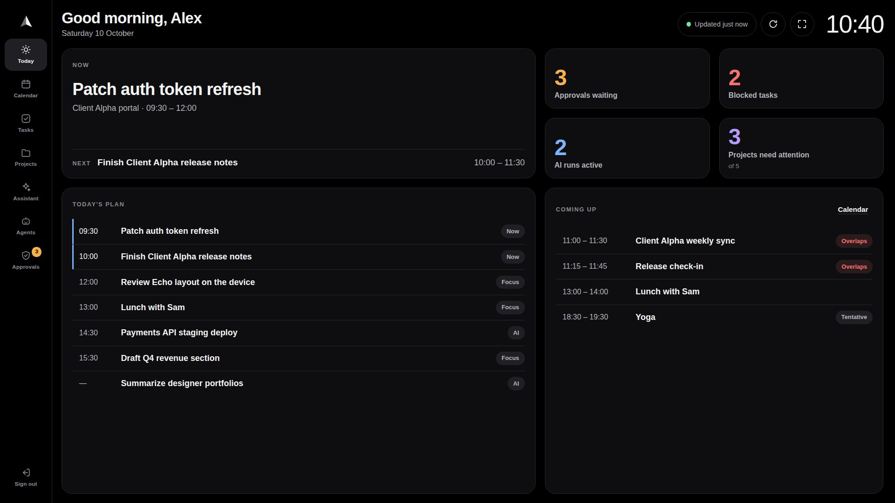

| | |
|---|---|
| 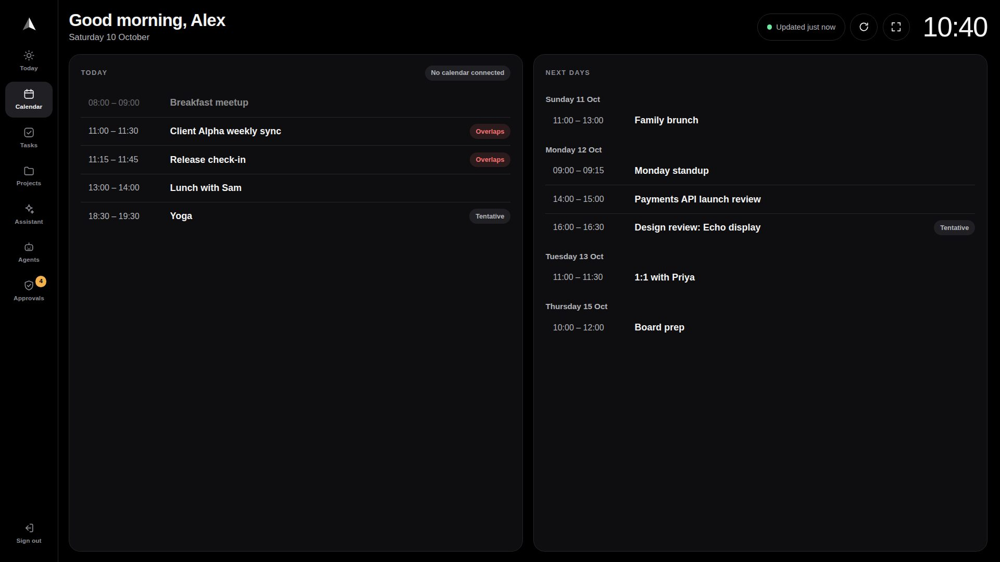 | 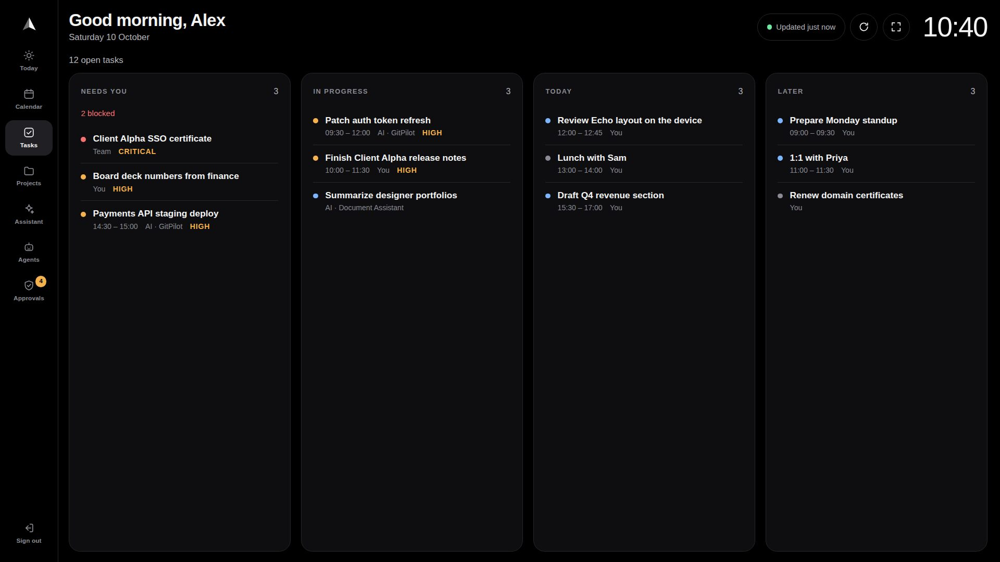 |
| 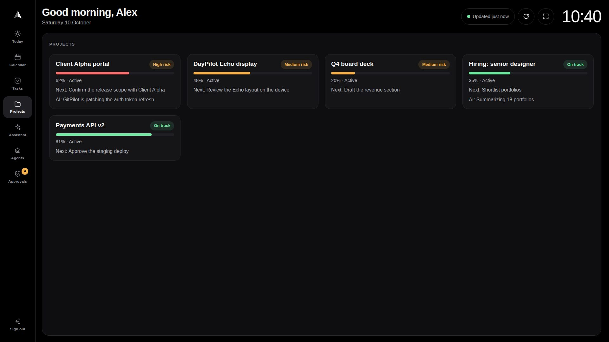 | 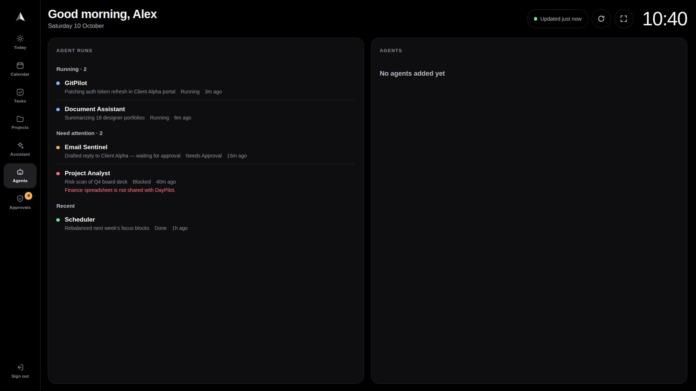 |
| 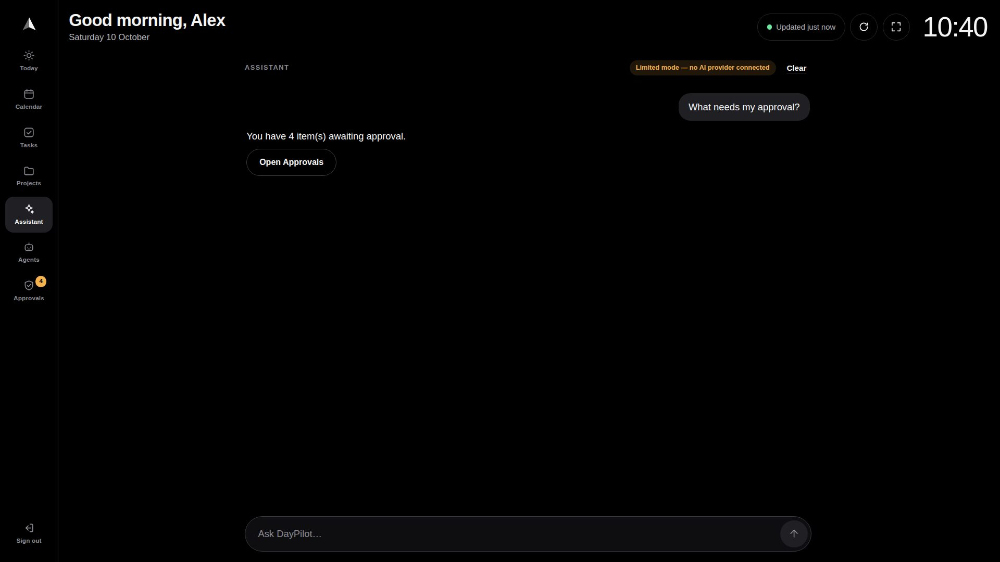 | 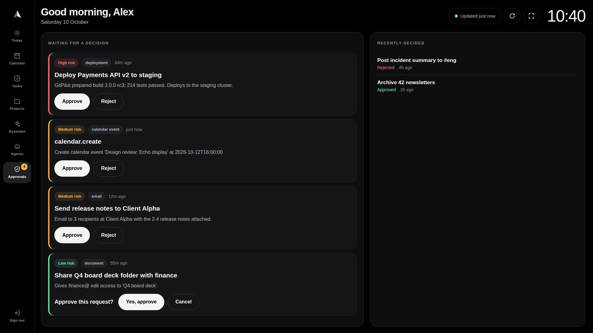 |

## What each section shows

Every number comes from an API response. When the server did not send a value the display shows
"—"; it never fills in a number (the mobile shell's fallback counters are not used).

| Section | Source | Notes |
|---|---|---|
| **Today** | `GET /v1/today`, `GET /v1/plans/{date}`, today's calendar events | *Now* and *Next* as the server's Today engine decides them; four tiles from the server's own counts (approvals waiting, blocked tasks, AI runs active, projects needing attention). No plan yet is a 404 and is shown as "No plan for today yet", not as an error. |
| **Calendar** | `GET /v1/calendar/events?start&end`, `GET /v1/calendar/status` | Today and the next six days. Cancelled events are left out; overlapping events are marked. The connection chip is the server's own sync label. |
| **Tasks** | `GET /v1/tasks?limit=200` | Open tasks in four groups: *Needs you* (blocked, needs approval), *In progress*, *Today*, *Later*. "Blocked" is the same rule as the server's blocker count, so the tile and the list agree. Says so when more than 200 tasks exist. |
| **Projects** | `GET /v1/projects?limit=100` | Riskiest first, with progress, next human action, AI activity and the first blocker. |
| **Assistant** | `POST /v1/assistant/turn`, `GET /health`, `GET /v1/providers/status` | Typed questions to the same backend orchestrator as the desktop. Shows *Ready*, *Limited mode — no AI provider connected* or *Unavailable*. No voice: see [voice](#voice). |
| **Agents** | `GET /v1/agents?limit=30`, `GET /v1/agents/profiles` | Agent runs (running, needing attention, recent) and enabled HomePilot agents; says so when the HomePilot runtime is off. |
| **Approvals** | `GET /v1/approvals?limit=50`, `POST /v1/approvals/{id}/decide` | Pending first, riskiest first. **Approve / Reject need a second tap** ("Yes, approve"); the decision is made, authorised and audited by the server. Decisions are paused while offline. A refusal (403) or a decision made elsewhere (409) is shown with the server's reason. |

## Setting it up

1. **Serve DayPilot over HTTPS, web and API on one origin.** The simplest is the gateway's
   single-origin mode — it serves the console at `/`, this display at `/echo`, and the API under
   `/api` — behind a TLS-terminating reverse proxy:

   ```bash
   pnpm --filter @daypilot/operator-web build      # builds the console and dist/echo/
   DAYPILOT_REQUIRE_SESSION=true DAYPILOT_COOKIE_SECURE=true \
     uvicorn app.main:app --app-dir services/api-gateway --proxy-headers --forwarded-allow-ips='<proxy ip>'
   ```

   For a static host (CDN, Cloudflare Pages, S3): publish `apps/operator-web/dist` as before;
   `dist/echo/index.html` is served at `/echo/`. Proxy `/api` on **the same host** to the gateway.
   A separate API domain is not supported for the Echo: the session cookie would be a third-party
   cookie, which the browser may block.

2. **On the Echo Show**, open the Silk browser, go to `https://<your-daypilot-host>/echo` and sign
   in with the on-screen keyboard. (How Silk is opened differs between device software versions.)

3. Optionally tap **Full screen** in the header. It is offered only where the browser supports it,
   and the device can leave full screen at any time.

Use an account whose role suits a screen that everyone in the room can see and touch.

## How it behaves

| | |
|---|---|
| **Refresh** | Today, the plan and approvals every 60 s; tasks, projects, calendar, agents and the assistant's status every 5 min. After 30 min without a touch the 60 s tier slows to 5 min; the first touch refreshes. |
| **Hidden or asleep** | Timers stop while the page is hidden (screen off, another app, Alexa content). On return, anything older than its interval is fetched immediately. A page restored from the back/forward cache is refreshed. |
| **Slow or failing network** | Every request has a 15 s deadline. Failures retry after 15 s, 30 s, 1 min, 2 min, 4 min, then every 5 min — never a tight loop. **Retry** and **Refresh now** are always available. |
| **Offline** | A banner says *Offline — showing what was loaded at 10:40*; the last data stays on screen and decisions are paused. It catches up when the connection returns. |
| **Stale data** | If a refresh fails after data was shown, the data stays, the card is marked **Not current** and the header says *Reconnecting…*. Data is never replaced by invented values. |
| **Errors before any data** | The section shows what happened in one sentence (e.g. *DayPilot had a problem (HTTP 500).*) with **Retry**. |
| **Session** | Signed-in displays confirm the session (`GET /v1/auth/me`) every 5 min and on **Refresh now**; an expired or revoked session shows *Your session has ended* and **Sign in again**, and polling stops. Sessions last `DAYPILOT_SESSION_TTL_DAYS` (14 days by default). |
| **Long sessions** | The clock re-renders once a minute; unchanged responses do not re-render; the assistant keeps the last 20 messages; nothing grows without bound. |
| **Nothing stored on the device** | Data is held in memory only — no localStorage, no service worker, no offline cache — so a shared device keeps nothing after sign-out or a reload. |

| Offline | A failed refresh | A section that never loaded | Session ended |
|---|---|---|---|
| 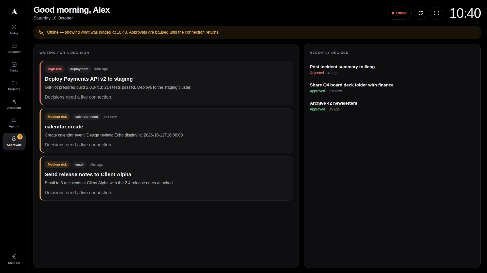 | 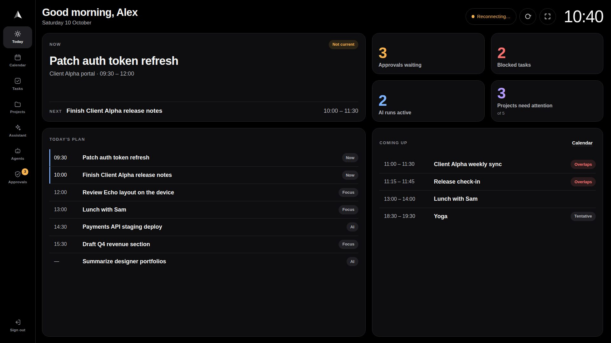 | 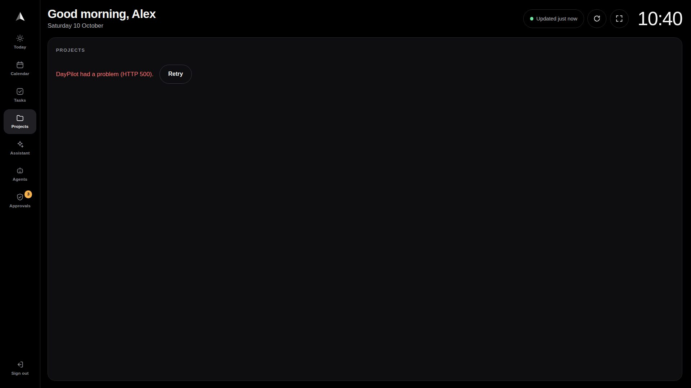 | 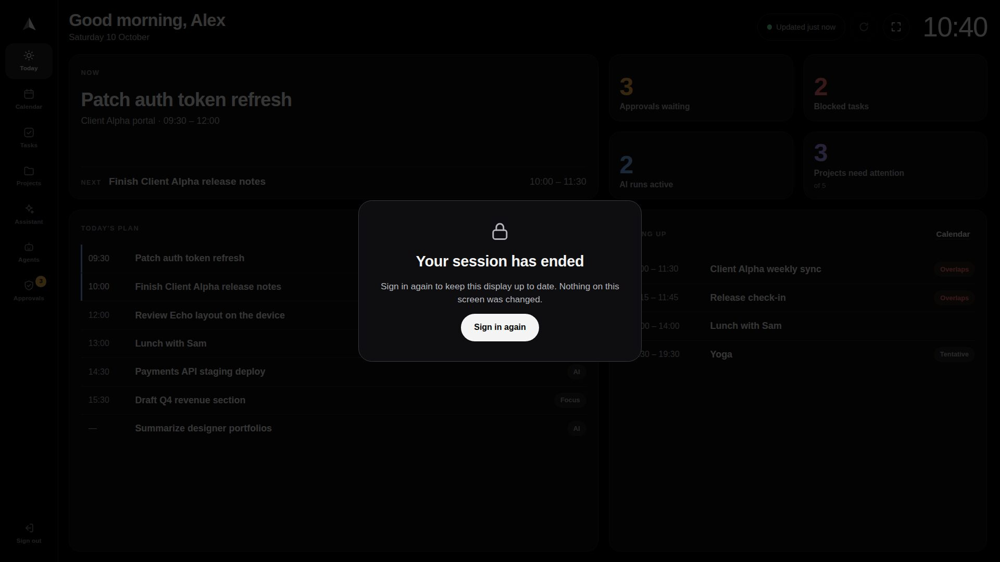 |

## Security and permissions

- **Same API, same rules.** The display calls only endpoints the desktop console already uses
  (plus an optional `start`/`end` window on `GET /v1/calendar/events` that returns a subset of
  the same data). It has no private API and gains no permission the signed-in user lacks.
- **Sign-in is the shared `AppGate`/`LoginPage`.** Sessions are HttpOnly cookies; writes send the
  CSRF double-submit header; no token is put in a URL or in browser storage.
- **HTTPS.** The page warns when it is not in a secure context. Set `DAYPILOT_COOKIE_SECURE=true`
  in production. `/echo` is served directly (not redirected), so a TLS-terminating proxy cannot
  turn it into an `http://` redirect.
- **Approvals.** The server decides who may approve what (`approvals/center.py`), records an
  audit entry and refuses a second decision. The display adds a confirmation tap and pauses
  decisions while offline; it does not relax anything.
- **A shared screen.** Anyone near the device can read it. Sign out from the rail when needed.

Known gaps in the existing backend, unchanged by this work (the display neither causes nor
works around them):

- Most `/v1` read endpoints do not check the session cookie themselves (the login gate is in the
  web app); this is why the display confirms the session with `/v1/auth/me`.
- `POST /v1/approvals/{id}/decide` takes its role from the bearer-token principal
  (`DAYPILOT_AUTH_ENABLED`), not from the cookie session, so a cookie-signed-in "view-only"
  user is not yet stopped from deciding by role.

## Amazon Echo Show and Silk limitations

These are properties of the device and its browser. The display is built not to depend on them;
none of them were verified on hardware for this change.

- **No persistent kiosk mode.** An Echo Show returns to its home screen or Alexa content on its own
  schedule: after inactivity timeouts, Alexa responses, timers and alarms, calls and Drop In,
  notifications, software updates and restarts. Silk may be closed or reloaded by the system. The
  display recovers when reopened (it refreshes on show, reload and back/forward restore) but it
  cannot keep itself on screen. DayPilot does not claim kiosk or always-on support.
- **No background execution.** Nothing runs while Silk is not showing the page; data is fetched
  again on return.
- **Voice.** <a id="voice"></a>The display uses no Web Speech or other voice API. "Alexa" is
  handled by the device and is not available to web pages. Voice access is planned as a separate
  Alexa skill: [alexa-skill-plan.md](alexa-skill-plan.md).
- **No push or notifications.** Web push, notifications and service workers are not used.
- **Browser version.** Silk is Chromium-based, but its version depends on the device software. The
  display needs a current Chromium (CSS `:where()`, `min()`/`clamp()`, `AbortController`); very old
  Silk builds are not supported.
- **CSS viewport and pixel ratio.** What Silk reports on a 1920 × 1080 panel is not documented; the
  layout was therefore tested at 1920×1080, 1920×1000 (browser bar visible), 1536×864 @1.25,
  1366×768, 1280×800, 1280×720 @1.5, 1024×600 and 960×540 @2. `/echo/?about` shows what the
  device actually reports.
- **On-screen keyboard.** The page asks Chromium to resize the layout when the keyboard opens
  (`interactive-widget=resizes-content`) so the assistant's input stays visible; whether Silk
  honours it on the Echo is unverified.
- **Full screen** may be refused or exited by the device at any time.
- **Cookies and site data** can be cleared by the device or the user; expect to sign in again.
- **Screen.** Brightness, night dimming, screen-off timing and burn-in protection are device
  settings; the display has no continuous animation.

## On-device verification checklist

Run on a physical Echo Show 21 before calling the display supported on it. Record the date, the
device software version and what `/echo/?about` reports.

| # | Check | Expected |
|---|---|---|
| 1 | Open `https://<host>/echo` in Silk | Sign-in page; no certificate or mixed-content warning |
| 2 | Sign in with the on-screen keyboard | Fields stay visible above the keyboard; dashboard opens |
| 3 | `/echo/?about` | Note the CSS viewport, pixel ratio and user agent |
| 4 | Tap every rail item; scroll each list with a finger | Responds to the first tap; lists scroll inside their cards; nothing cut off |
| 5 | Compare Today's tiles with the desktop console | Same numbers |
| 6 | Approve and reject one item each | Second tap required; item leaves the queue; the desktop shows the decision |
| 7 | Assistant: tap a suggestion, type a question | Reply appears; input not hidden by the keyboard |
| 8 | Reload Silk | Same section, still signed in |
| 9 | Interruptions: ask Alexa a question, set and dismiss a timer, receive a call or Drop In, then return to Silk | Page is back (or reopens) and refreshes; note whether Silk kept the page |
| 10 | Let the screen turn off; wake it | Clock correct; data refreshes within a minute |
| 11 | Leave it for 1 hour, then overnight | Header shows a recent "Updated…" after a touch; no errors; note if the page was closed |
| 12 | Turn Wi-Fi off, then on | Offline banner, decisions paused; recovers by itself |
| 13 | Stop the DayPilot server, then start it | "Reconnecting…", data kept and marked; recovers |
| 14 | End the Echo's session elsewhere (`POST /v1/auth/logout-all` for that user, or let it expire) | "Your session has ended" within 5 minutes or on **Refresh now** |
| 15 | Full screen on and off | Works, or the button is absent |
| 16 | Sign out on the Echo | Sign-in page; reload does not show data |

## What was verified, and how

`scripts/echo_e2e.sh` builds the web app, starts a throwaway gateway that requires sign-in on a
temporary SQLite database, seeds it through the API (`tests/ui/echo_seed.py`) and runs
`tests/ui/echo-e2e.mjs` in Chromium with touch input:

- `/echo` served as its own page; sign-in by touch; every section compared with the API's own
  responses; an approval decided with two taps and confirmed in the server; reload; `?about`;
  offline; a failing refresh; an endpoint failing before any data; a session ended elsewhere;
  the desktop console still loading;
- eight viewports (above), each section checked for clipped controls, sideways scrolling and touch
  targets under 44 px.

Unit tests: `tests/test_echo_model.py` (failure handling, retry timing, calendar days, task
groups, agreement with the server's counts), `tests/test_webserve.py` (`/echo` routing),
`tests/test_calendar_window.py` (the calendar window).

| 1280 × 720 @1.5 | 1024 × 600 | 960 × 540 @2 |
|---|---|---|
| 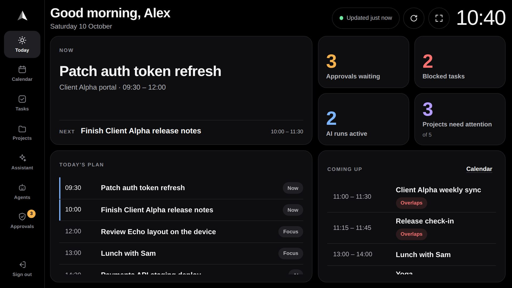 | 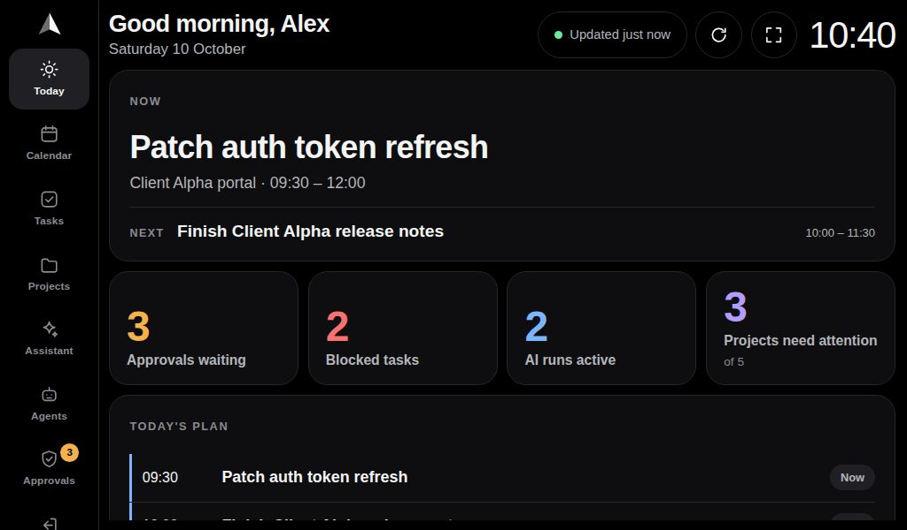 | 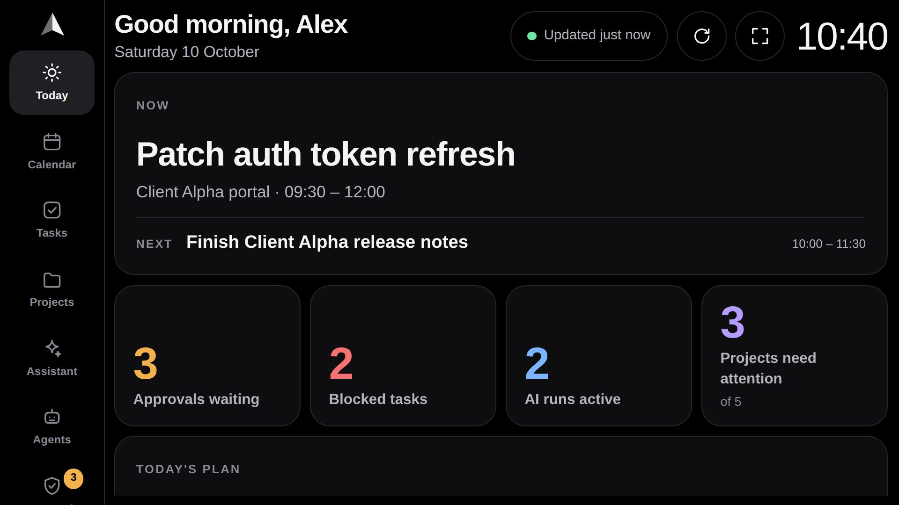 |

## Code

| | |
|---|---|
| `packages/ui-bridge/src/echo/EchoDashboard.tsx` | The dashboard (sections, header, rail, states) |
| `packages/ui-bridge/src/echo/echoData.ts` | One request path (timeouts, CSRF, failure classes) and the refresh scheduler |
| `packages/ui-bridge/src/echo/echoModel.ts` | Pure rules, tested by `tests/test_echo_model.py` |
| `packages/ui-bridge/src/echo/echo.css` | Styles, all scoped under `.echo` |
| `apps/operator-web/echo/index.html`, `src/echo.tsx`, `src/echo.css`, `vite.echo.config.ts` | The `/echo` entry, built by a second Vite pass so the console's build is unchanged |
| `services/api-gateway/app/webserve.py` | Serves `/echo` in single-origin mode |
| `services/api-gateway/app/routers/calendar.py` | Optional `start`/`end` window on `/v1/calendar/events` |

Reused from the shared package: `AppGate` and `LoginPage` (sign-in), `apiClient` (gateway base,
workspace header), `authClient.csrfToken`, the approvals queue rules, task and project mappers,
the Today plan helpers, the calendar sync label and the agent portrait URL helper.
