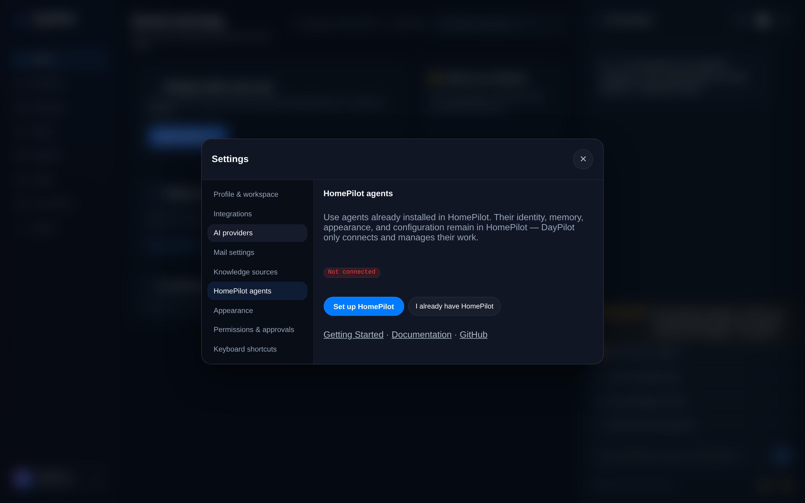
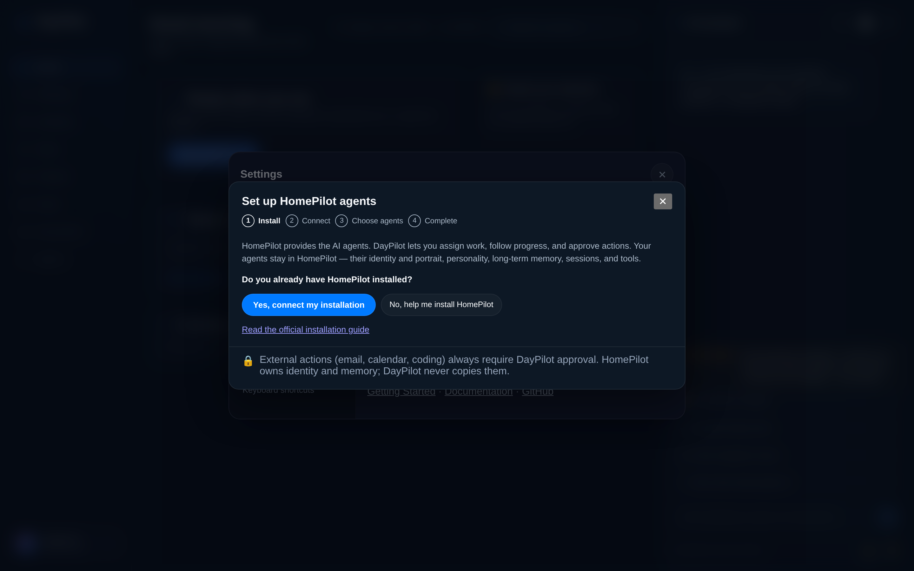
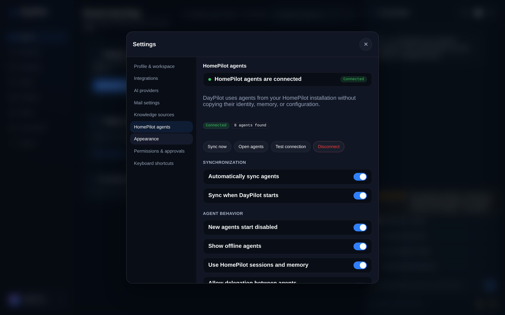

# Connecting HomePilot — the onboarding experience

HomePilot owns the agents; DayPilot connects to them and manages their work. The
integration is a **first-class connection between two apps**, enabled by default
— not an environment variable to toggle. Everything below is driven by the
backend connection-state machine (`GET /v1/homepilot/setup/status`).

## Not connected

With nothing connected the panel is a **setup prompt, not an error**. The old
"turned off — set `DAYPILOT_HOMEPILOT_RUNTIME_ENABLED=true`" message is gone;
ordinary users never see a variable name.

## Guided setup wizard

**Install → Connect → Choose agents → Complete**, with a visible progress
indicator. Detection and connection-testing run on DayPilot's backend (the
browser never probes the network); install steps only *show and copy* Docker /
Compose commands and link to the official HomePilot docs — nothing is ever
executed from the browser. Agent selection is opt-in and new agents start
disabled.

## Connected

Once connected, the page shows the connection, account, and agent count, plus
**Synchronization** and **Agent behavior** preferences that persist per
connection. The permanent safety rule — *external actions require DayPilot
approval* — is shown locked and is never a preference.

## Administrator lock

An administrator can hard-disable the integration by setting
`DAYPILOT_HOMEPILOT_RUNTIME_ENABLED=false`. Ordinary users then see
"HomePilot agents are unavailable — disabled by your administrator" (never the
variable name). Every other state is a normal, enabled connection state.

## Backend endpoints

| Endpoint | Purpose |
| --- | --- |
| `GET /v1/homepilot/setup/status` | Connection-state machine (always reachable, even under the admin lock). |
| `POST /v1/homepilot/setup/detect` | Backend-only sweep across topologies — see below. |
| `POST /v1/homepilot/setup/test` | Connection checklist (reachable / authenticated / personas / chat / version). |
| `POST /v1/homepilot/connections` | Create/update a connection (key held server-side). |
| `PATCH /v1/homepilot/connections/{id}` | Update sync + agent-behavior preferences. |
| `POST /v1/homepilot/connections/{id}/sync` | Sync agent references from HomePilot. |

Security: the API key is posted once and held server-side (never returned to the
browser); detection/testing reject cloud-metadata and link-local addresses; the
browser never runs shell or Docker commands.

## How detection works

HomePilot ships in several topologies, and DayPilot may be reaching it across a
boundary. Detection is the product of **discovered hosts × port profiles**,
probed in parallel:

- **Port profiles** — `7860` with the API under `/api` (desktop app / single
  container) and `8000` with the API at the root, UI on `3000`
  (`make run` / Compose / source).
- **Hosts** — the `homepilot` Docker service name, `host.docker.internal`,
  loopback, plus **runtime-discovered private gateways**: the Docker bridge
  (`172.17.0.1`), the default-route gateway (`/proc/net/route`), and the
  `/etc/resolv.conf` nameserver (on **WSL2** this is the Windows host, where a
  host-side HomePilot actually lives). Public IPs are never probed.
- **Probe** — each candidate is checked on both `/health` **and** the
  OpenAI-compatible `/v1/models` (some builds answer only one; `/v1/models` is
  the same endpoint OllaBridge uses), so a running-but-key-gated instance still
  registers.

This is why a WSL2 HomePilot started with `make run` (backend `:8000`, frontend
`:3000`) is now found even when DayPilot runs in a container and `127.0.0.1`
doesn't reach the host.
