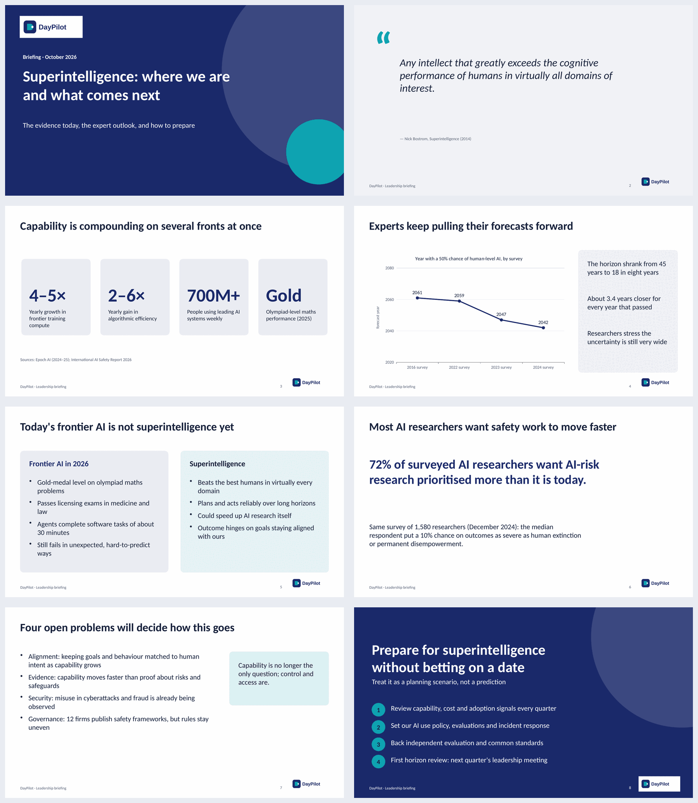

# Example: “Superintelligence: where we are and what comes next”

A 5-minute leadership briefing built end to end with DayPilot Presentations: company brand with an
SVG logo, a sourced storyline, a timed speaker script, a native PowerPoint file, the actual-render
quality check, and the script as a document.



| File | What it is |
|---|---|
| [`superintelligence-5min.pptx`](superintelligence-5min.pptx) | The deck: native, editable PowerPoint (real text, chart, shapes), 16:9, brand theme colours and fonts, slide numbers and footer. Each slide's speaker notes start with its time, its start in the talk and its word count, then the words to say |
| [`script-5min.md`](script-5min.md) | The speaker script with timings, as downloaded from **Download script** |
| [`storyline.json`](storyline.json) | What was written: the storyline, the per-slide script and the time each slide gets (`daypilot.storyline/v1`) |
| [`logo.svg`](logo.svg) | The brand logo; the server cleans it and converts it to a transparent PNG |

Rebuild it against a running gateway (`DAYPILOT_PRESENTATIONS=true`, render worker installed):

```bash
scripts/presentations_example.sh http://127.0.0.1:8890 5     # or 3, 10, 15 …
```

## How it was made

1. **Brand.** Company “DayPilot”, navy `#1B2A6B` and teal `#0FA3B1`, Calibri, footer and the SVG logo.
2. **Storyline.** Eight slides, one idea each: cover, definition (quote), today's capability (KPIs),
   expert forecasts (line chart), today vs. superintelligence (comparison), what researchers think
   (statement), open problems (bullets), recommendation (closing). Every figure comes from the
   sources below and is cited in the slide's notes.
3. **Timing.** Talk length 5 minutes at a natural pace (~140 words/min). The planner gives each
   slide its share (20–50 s) and a word budget; the script was written to those budgets and every
   slide reports “fits its time”.
4. **Build and check.** Composed, exported to PowerPoint, rendered with LibreOffice and checked
   (text fit, contrast, logo proportions, native objects, notes): 8 slides, 0 problems.
5. **Human review.** Every rendered slide was then looked at. That review found three engine
   defects, now fixed for all decks: a line chart of years drawn from zero looked flat (line charts
   now get a fitted axis; bars and columns keep zero), the SVG logo carried a white box onto light
   slides (the rasteriser now keeps transparency), and KPI figures were sized one by one (they now
   share one size).

## Same deck, other talk lengths

The planner re-times without touching the words and says where the script no longer fits:

| Slide | 3 min | 5 min | 15 min |
|---|---|---|---|
| Cover | 15 s | 20 s | 55 s |
| Definition | 20 s | 25 s | 70 s |
| Capability today | 25 s | 45 s | 130 s |
| Expert forecasts | 25 s | 45 s | 145 s |
| Today vs. superintelligence | 30 s | 50 s | 165 s |
| What researchers think | 20 s | 35 s | 100 s |
| Open problems | 25 s | 45 s | 140 s |
| Recommendation | 20 s | 35 s | 95 s |
| Script fit | 7 of 8 slides too long | all fit | all too short, and “a slide with more than 2½ minutes usually works better split in two” |

In the app, **Script and timing → 3 min → Re-time and rewrite script** shortens every slide's words
to its new budget (with a connected AI model; without one, the script is composed from the slides).

## Sources

- N. Bostrom, *Superintelligence: Paths, Dangers, Strategies*, Oxford University Press, 2014 (definition).
- Epoch AI, [Training compute of frontier AI models grows by 4–5× per year](https://epoch.ai/publications/training-compute-of-frontier-ai-models-grows-by-4-5x-per-year).
- [International AI Safety Report 2026](https://internationalaisafetyreport.org/publication/international-ai-safety-report-2026) (3 February 2026): algorithmic efficiency 2–6× per year, 700 million+ weekly users, olympiad gold-level maths, professional licensing exams, ~30-minute agent tasks, 12 company safety frameworks.
- K. Grace et al., [*Advanced AI according to 1,580 researchers: uncertain, unsafe, and sooner than we thought*](https://aiimpacts.org/wp-content/uploads/2026/09/ESPAI2024.pdf) (AI Impacts, September 2026; survey run December 2024): 50% forecast year 2061 → 2059 → 2047 → 2042, 72% favour more priority for AI-risk research, median 10% on extinction-level outcomes.

Figures are as published by those sources; the forecasts are survey aggregates with very wide
uncertainty, as the deck itself says.
