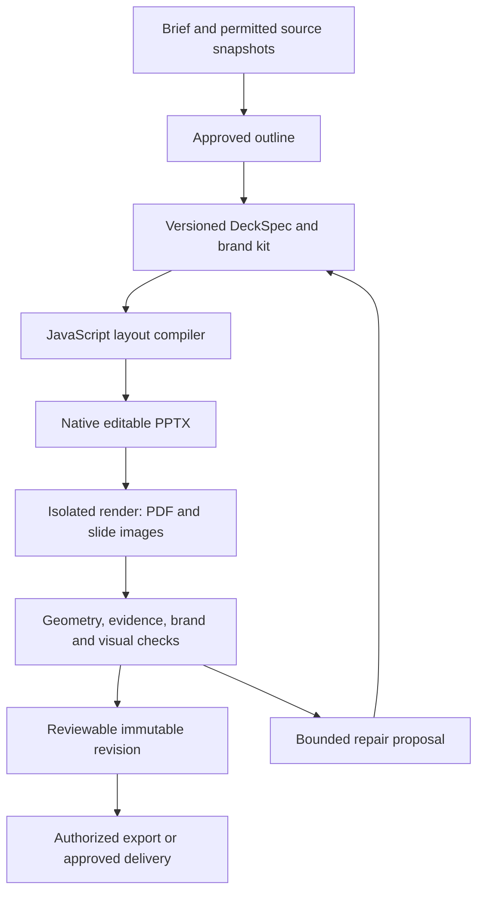

# Technical design

This is a proposed architecture, not a description of a deployed presentation service. Names and contracts below are reserved for implementation review. The accompanying schemas deliberately describe serializable core inputs rather than every database row or API response.

## Pipeline and authoritative artifacts

The source of truth is a validated, versioned `DeckSpec` plus its pinned inputs. The compiler produces `.pptx`, not an HTML screenshot wrapped inside a PowerPoint slide. A derived editable scene graph stores native element identities, geometry and reading order. Actual exported-file previews are authoritative for review. An HTML/canvas view may support immediate editing feedback, with a visible pending-render state until export completes.

| Layer | Responsibility | Contract boundary |
| --- | --- | --- |
| Source preparation | Permission checks, bounded extraction, typed metric definitions, snapshots | Snapshot IDs, hashes, locators, reporting windows |
| Story planner | Outline, narrative, claims and visual intent | Structured output validated before layout |
| Composer | Select approved layouts, calculate geometry, fit content | Stable slide/element IDs and explicit native objects |
| JavaScript compiler | Deterministic layout logic and renderer adapter | `DeckSpec + BrandKit + TemplateSpec + assets → artifacts` |
| Export adapter | Native editable objects, themes, notes and metadata | Adapter capability report; unsupported objects reject or disclose fallback |
| Renderer | Render the actual exported PPTX, rasterize PDF, contact sheet | Artifact digest, renderer/version/fonts, per-slide images |
| Quality reviewer | Evidence, structure, readability, brand, geometry and visual inspection | Version-bound findings and quality receipt |
| Presentation service | Authorization, revisions, jobs, review, download and delivery | Server-owned scope, immutable artifact references, fenced publication |

Proposed production default: pinned PptxGenJS behind `PresentationRenderer`. It supplies JavaScript-native text, shapes, tables and charts and direct OOXML export. Use an adapter so another renderer can be adopted without changing the product contract. Evaluate an artifact-tool adapter only where runtime availability, deployment terms and operational ownership are confirmed; a private development runtime is not a production dependency.

Existing `.pptx`/`.potx` preservation is a separate capability. PptxGenJS composition alone is not a universal import/edit/round-trip solution. Spike an OOXML preservation adapter on representative real company templates before offering the fidelity promise. Reuse supported theme/master parts and placeholders; retain unsupported parts only if actual export/render proves fidelity. Otherwise offer an explicit normalized template, preserve the original, and disclose changes. Do not implement a fragile general-purpose ZIP/XML rewrite during the first release.

### Native objects and editability

- Titles, body copy, labels, tables, supported charts, footers and diagrams use native PowerPoint objects. Native charts carry their source series and categories. Tables retain cell data; charts/tables are not screenshots.
- Convert dmind nodes and edges to editable shapes/connectors with stable IDs and label metrics. Reject an over-dense graph or move agreed detail into an appendix. Unsupported diagrams may use a disclosed image plus an editable/source companion; they cannot pass a native-diagram requirement.
- Images preserve original approved logos and asset provenance. Raster illustration/photo use is intentional, with crop geometry and alt text. Font embedding and redistribution depend on rights and renderer support; do not silently embed restricted fonts.
- Notes contain audience-facing speaker guidance and source references. Quality diagnostics, model prompts and internal policy messages stay in a separate report.
- Download options: PPTX (primary), rendered PDF, slide PNGs/contact sheet, source bundle and sanitized quality report. Do not claim PDF is editable. Web sharing displays the exact approved render.

### Reproducibility and generated JavaScript

The compiler is TypeScript/JavaScript with a narrow layout API. Normal AI mode generates validated data and layout choices, never arbitrary executable text. The compiler injects required template footer/logo objects at mapped placeholders; these derived objects are recorded in the scene graph and undergo the same render/editability checks as authored content. An exported source bundle contains a deterministic `.mjs` builder, JSON inputs, an asset manifest and build instructions with pinned versions. Source bundles omit credentials and restricted source material unless separately authorized. Asset references require permission on regeneration.

Capture compiler/adapter/renderer versions, template/brand version and digest, font digests/rights, input source hashes, model/provider/version where available, generation parameters, seed where supported, timestamps, output hashes, quality receipt and repair history. Stable semantic output is the target; ZIP timestamps and office-specific rendering can prevent byte-for-byte or pixel-identical cross-platform results. Record reproducibility limitations rather than promising universal identity.

An optional later **Expert JavaScript** mode lets Claude Code/Codex propose a builder. Review the diff, compile it in an isolated worker and return a new candidate revision. Enforce process/container isolation, no outbound network, no credentials, a read-only allowlisted asset mount, an ephemeral output directory, CPU/memory/time/output limits and no runtime dependency installation. AST allowlists and static checks supplement isolation; they are not a security boundary. Never `eval` provider text in the API, browser, desktop shell or shared orchestrator. An image connector receives a separate permission-scoped request and supplies hashed assets to this worker.

## Additive repository seams

| Existing seam | Proposed addition | Constraint |
| --- | --- | --- |
| `packages/ui-bridge/src/shell/route.ts` and portal shells | Feature-flagged `presentations` view and lazy-loaded presentation screens | Preserve existing route identities, order and shortcuts |
| `services/api-gateway/app/routers/` | `presentations.py`, server policy/service layer and explicit router registration | Session/membership enforcement and CSRF on browser writes |
| `services/knowledge-service/daypilot_knowledge/db/models.py` | Presentation-specific scoped rows and next available additive migration | No edits to existing source contents or historical migrations |
| `services/orchestrator/daypilot_orchestrator/jobs/` | New `presentations.*` handlers plus run lease/fence service | Isolated from planner/design-intake task creation |
| `packages/presentation-engine/` (new) | TypeScript compiler, adapter, layouts, contract validation, native object builders | Pinned dependencies; separate worker process |
| Existing Documents/source grants | Permission-checked snapshot adapter and optional generated-output reference | Existing Document fields alone do not prove workspace/company access |
| Existing Approval/Event models | Existing approval entry referencing a presentation scope row; scoped progress events | No implicit sharing and no confidential event payloads |
| dmind/Matrix Designer integration | Read approved graph/design snapshots into slides | Never call bundle intake or launch coding as a deck-generation side effect |

Check paths against the repository when implementation begins; do not assume a design document installs these modules. Rendering dependencies belong in an opt-in worker image, not the desktop/UI startup path. Local mode supports the same compiler and an available local render service; if no renderer is installed, show the capability failure and prevent a verified-quality claim.

## Proposed storage and authorization

Use SQL-backed metadata and an artifact-store abstraction for local storage or configured object storage. Every query begins with server-derived workspace membership and the relevant company grant. Client-supplied IDs are references, not authority. Do not expose paths or bucket keys in client contracts.

| Proposed entity | Stored state and invariants |
| --- | --- |
| `PresentationCompany` / `PresentationCompanyGrant` | Workspace ownership, company identity, role grants; no new authentication tenant |
| `PresentationBrandKitVersion` | Immutable validated tokens, fonts, approved asset references, digest; mutable active-version pointer is separately authorized |
| `PresentationTemplateVersion` | Immutable size/layout/placeholder rules, kit binding, original file reference, import fidelity report and sample review |
| `PresentationAsset` | Workspace/company, content hash, media type, original/derived relationships, rights and retention policy |
| `PresentationDeck` | Company/project link, current revision pointer, archive state, owner; compare-and-swap head updates |
| `PresentationRevision` | Parent/base, pinned specs/inputs, stable object IDs, human locks, state; published contents immutable |
| `PresentationSourceSnapshot` | Granted source/version/digest, extraction, typed metrics, cutoff and access policy; no unscoped Document lookup |
| `PresentationRun` | Job reference, idempotency key, phase, attempt, resource budget, lease owner/expiry/epoch, cancel state |
| `PresentationArtifact` | Immutable output type/hash/store reference, revision/run/fence, scope, retention; publish only with valid lease |
| `PresentationQualityReceipt` | Export hash, render hashes, check versions, findings/overrides, exact revision binding |
| `PresentationSeriesVersion` / `PresentationOccurrence` | Immutable recipe; unique series/version/period occurrence, frozen inputs, draft revision and delivery status |
| `PresentationPatch` | Base revision and object versions, proposed edits, lock/conflict results, accepted revision |
| `PresentationReviewScope` / `PresentationDelivery` | Exact revision/artifact/quality digest, recipient or link policy hash, existing Approval reference, idempotent delivery receipt |

The physical table count may be reduced through normalized shared metadata; preserve the invariants. An active brand pointer does not rewrite prior versions. Existing Documents are owner/project/source-linked and do not have a workspace field: resolve explicit source grants and ownership before creating a workspace-scoped snapshot. A project ID alone is insufficient. A generated output may be registered as a new generated Document, with its scope enforced through presentation artifact policy. Never mutate the input Document.

Roles: company owner/brand administrator, deck editor, reviewer and viewer. Viewer download permission is explicit. Template activation, review and delivery are distinct permissions. Define a permission matrix in implementation tests, including cross-company denial within the same workspace. A collaborator can see neither thumbnails nor source citations for an unauthorized deck.

## API contract outline

All paths below are proposed under `/api/presentations`. List responses use cursor pagination. Mutation requests use `Idempotency-Key`; content edits include `expected_revision_id` or `If-Match`. Return `409` for concurrent changes and `403` for inaccessible resources without returning content. Expensive work returns `202 {run_id, resource_id, status_url}`. Validate permissions again when a worker begins and before artifact publication/delivery.

| Operation | Endpoint | Result/guard |
| --- | --- | --- |
| Company and brand setup | `POST /companies`; `POST /companies/{id}/brand-versions` | Draft version; member and brand-admin policy |
| Bounded upload | `POST /assets/uploads`; `POST /assets/uploads/{id}/finalize` | Scoped upload; server validates actual bytes/type/hash/limits |
| Template import/sample | `POST /companies/{id}/template-versions`; `POST /templates/{id}/sample-runs` | Async import/sample with capability/fidelity report |
| Activate brand/template | `POST /brand-versions/{id}/activate`; `POST /templates/{id}/activate` | Review receipt + expected active-version pointer; version never mutated |
| Start wizard | `POST /decks`; `POST /decks/{id}/source-snapshots` | Draft deck and granted immutable inputs |
| Outline | `POST /decks/{id}/outline-runs`; `POST /decks/{id}/outline-acceptance` | Candidate outline then explicit frozen outline acceptance |
| Generation | `POST /decks/{id}/generation-runs` | Budget-bound run against accepted outline/base revision |
| Edit/regenerate | `POST /decks/{id}/patches`; `POST /patches/{id}/accept`; `POST /decks/{id}/regeneration-runs` | Per-object lock checks, base CAS, scoped selection |
| Read/review | `GET /decks/{id}`; `GET /decks/{id}/revisions`; `POST /revisions/{id}/reviews` | Exact artifacts/findings; immutable review binding |
| Artifacts | `GET /artifacts/{id}/download`; `GET /revisions/{id}/preview` | Short-lived authorized content; private cache controls |
| Series | `POST /series`; `POST /series/{id}/versions`; `POST /series/{id}/prepare`; `POST /series/{id}/pause` | Draft-only recipe version; prepare pins a reporting period |
| Run control | `GET /runs/{id}`; `POST /runs/{id}/cancel` | Cancel marks fence invalid; private scoped progress stream |
| Restore/archive | `POST /decks/{id}/restore`; `POST /decks/{id}/archive` | Restore appends revision; archive preserves files/history |
| Share/send | `POST /revisions/{id}/delivery-proposals`; `POST /deliveries/{id}/execute` | Exact audience/action-bound approval and configured provider |

Quality state and artifact-store URLs are server-owned fields; callers cannot submit a schema field to declare a deck approved. State transitions: `draft → outline_ready → composing → exported → checking → review_ready → approved`. Failed/cancelled runs attach to a candidate revision and leave the prior head available. An edited approved revision becomes a new draft. Downloading an authorized draft is possible with clear draft/unverified labeling; distribution requires the configured review/quality policy. A hard correctness/brand-rights failure cannot be silently bypassed. Only designated noncritical findings support a recorded reviewer override bound to the exact artifact.

## Jobs, leases and publication

Use namespaced jobs: `presentations.extract`, `.outline`, `.compose`, `.export`, `.render`, `.check`, `.prepare_occurrence`, `.deliver`. Existing queue facilities supply durable enqueueing and due times, but the current `claim_next` read/update sequence is not a multi-worker lease guarantee. Do not assume exactly-once execution or rewrite unrelated planner jobs to deliver this feature.

For presentation runs, implement atomic compare-and-swap claim/renew on `PresentationRun`: database time, bounded expiry and monotonically increasing lease epoch. A worker receives `(run_id, epoch)` and may advance phase/publish only while the matching lease and uncancelled state remain valid. Long exports renew; a crashed worker expires. Each phase writes immutable attempt objects to staging. A transaction validates fence, revision CAS, source access and artifact hashes before exposing the candidate. Stale workers cannot overwrite newer outputs, even if they finish later. Clean orphaned staging objects by retention, not by broad directory deletion.

Use a unique idempotency key per scope/operation, validate identical request hashes on replay, and reject mismatched reuse. Retry transient provider/render failures with bounded attempts/backoff and a total budget. Do not retry invalid evidence, unsupported template objects, denied sources or user cancellation as transient errors. Publish sanitized progress and failure codes; logs never include source text, secrets or recipient tokens.

## Weekly series and delivery

Store IANA timezone, local report-period rule, source cutoff, explicit owner, pinned brand/template, immutable recipe version and optional draft schedule. Resolve calendar reporting windows in the series timezone before converting boundaries to UTC. Keep actual UTC run time and timezone database version. Daylight-saving gaps move to the first valid local instant; folds use the first occurrence. A preview shows the next three effective runs and report periods.

An occurrence has a unique `(series_id, recipe_version, period_key)` and freezes the effective recipe and snapshots. Manual and scheduled preparation converge on that occurrence. A rerun creates a new candidate revision, not a duplicate occurrence or delivery. Comparisons use stable metric IDs plus unit/definition/window checks. Missing, stale or revoked inputs become explicit gaps or block according to recipe policy. Never silently reuse last week's facts as this week's.

Late scheduler recovery prepares only the latest eligible period within a configured catch-up window; historical backfills require a deliberate request. Series changes affect future occurrences. Pausing prevents new runs; cancel is available for in-flight runs. Source revocation blocks future extraction and unpublished output, and follows the workspace's existing retention/legal policy for retained approved artifacts.

Scheduled generation produces drafts and owner review notifications through an explicitly configured notification channel. It does not email, publish links or overwrite last week's deck. Delivery proposals bind revision, artifact hash, quality receipt, company identity, recipient set or link access/expiry policy, and provider action. Existing `Approval` references a presentation review scope that holds this immutable binding. Executing after any scope change requires a new proposal/approval. Delivery adapters use provider idempotency where available; ambiguous network outcomes require reconciliation instead of blind resend.

## dmind, Matrix Designer and MCP

Consume immutable dmind graph revisions as sources with node/edge provenance. The presentation compiler maps supported objects to native editable shapes; it never changes the original graph. A Matrix Designer bundle may supply an approved architecture snapshot or presentation outline proposal. Keep `design/bundle_intake.py` out of this flow because its project/task intake effects are unrelated to deck creation. Sending a deck-derived implementation plan to GitPilot/Claude Code/Codex remains a separate explicit action.

Proposed MCP contracts follow `docs/mcp-tool-contracts.md`:

| Tool | Writes/risk | Inputs and authority |
| --- | --- | --- |
| `presentations.list_templates` / `get_revision` | Read/low | Workspace/company-scoped IDs; returns permitted metadata |
| `presentations.propose_outline` | Draft/low | Granted source IDs, pinned template, brief; no delivery |
| `presentations.generate` / `prepare_weekly` | Draft/medium | Approved outline or recipe, budget, idempotency key; async candidate |
| `presentations.propose_patch` | Draft/medium | Exact base, selected objects, instruction; locks preserved |
| `presentations.export` | Artifact/medium | Authorized exact revision, requested formats; server quality status |
| `presentations.propose_delivery` | Proposal/medium | Exact recipients/policy/artifact; obtains immutable review scope |
| `presentations.execute_delivery` | External/high | Approved scope ID; server validates freshness and executes once |

MCP callers cannot bypass source permissions, brand activation, expert-code sandboxing or approval requirements. Credentials stay in configured integration gateways; generated `.mjs` contains none.

## Operational constraints

Initial configurable ceilings to validate in the implementation spike: 50 slides, 50 MB per attachment, 200 MB total raw inputs, 10,000 archive entries, 500 MB expanded import, 100 native elements per slide and 8 megapixels per raster output. Limit ZIP inflation ratio, nested archives, extraction pages/cells and per-object dimensions. Reject macro-enabled files, active content, external relationships and unsupported encrypted files. These are starting ceilings, not proved capacity figures; tune them with representative templates and enforce server-side before extraction.

Use sanitized SVG (no scripts/external URLs), safe XML parsers, local allowlisted asset resolution and separate unprivileged import/render containers with network denied. Run LibreOffice headless with a unique temporary user profile per worker; render PPTX to PDF and rasterize to review images. A LibreOffice pass does not certify exact PowerPoint rendering. Keep a Windows/Mac/Web PowerPoint acceptance corpus and capability report.

Metrics: phase latency, queue age, token/image spend, render failures, clipping/fact/brand failures, retries, locked edit conflicts, stale lease publications rejected, weekly completeness and delivery reconciliation. Release thresholds are in the quality and development documents. Retention is explicit per company/workspace; original inputs and approved decks are never removed by a failed generation or rollback. Exported external copies cannot be remotely revoked; the share UI must accurately describe this limitation.
