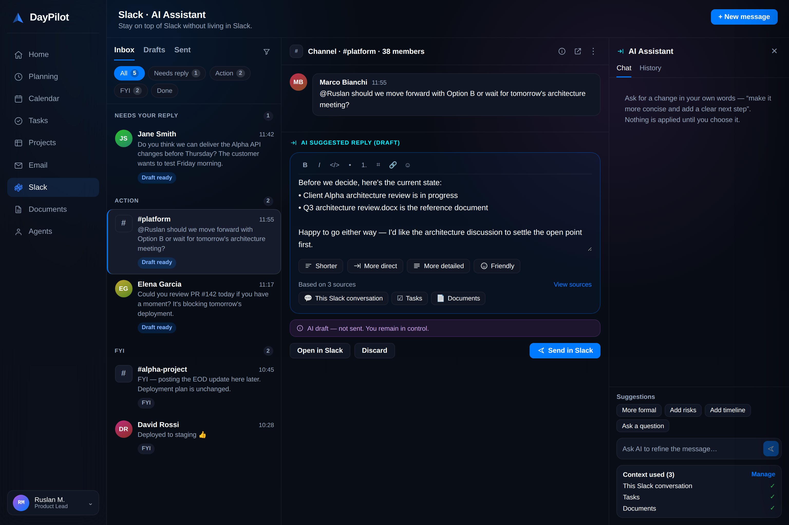
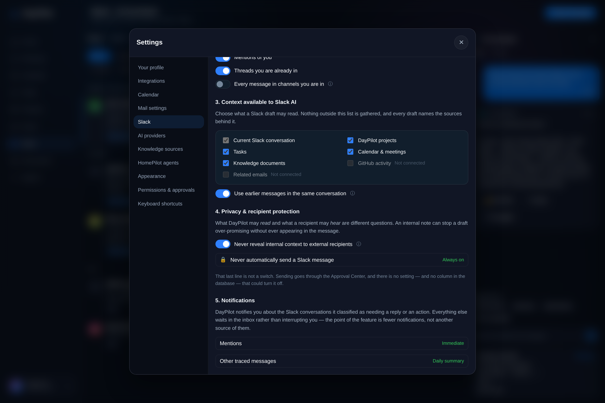
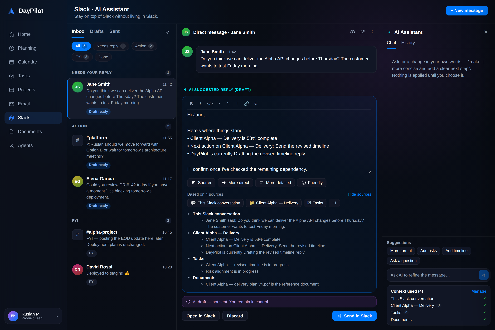
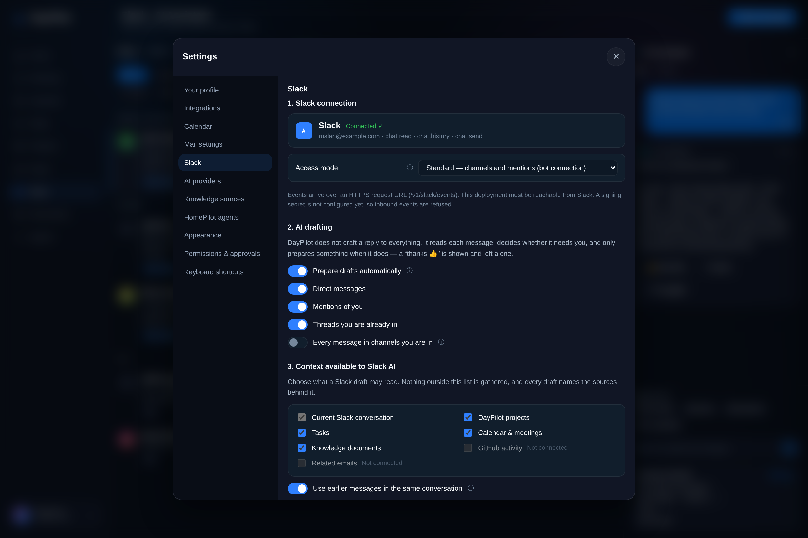
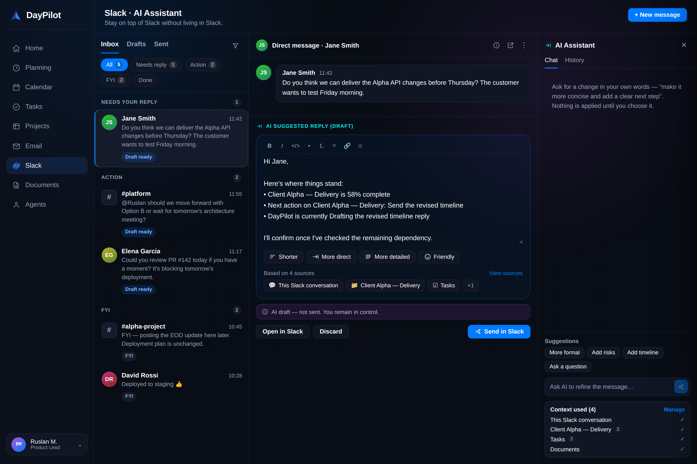
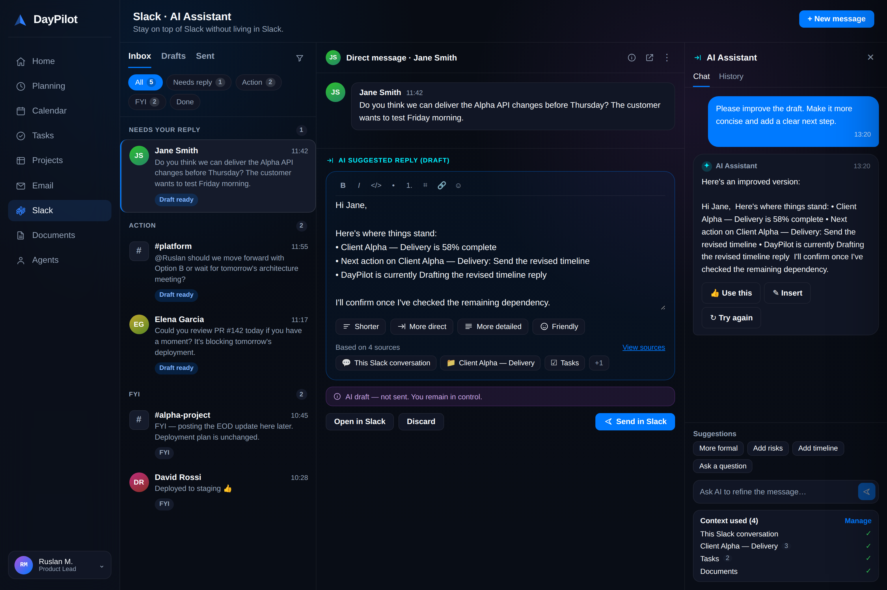
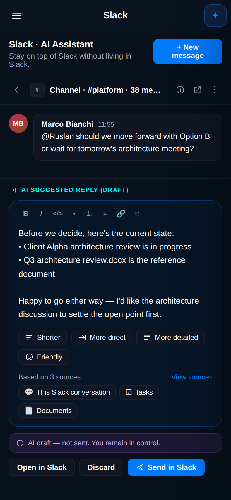

# Slack — stay on top of Slack without living in Slack

> **AI always drafts. The user always decides what gets sent.**

An optional DayPilot module that turns Slack from a notification source into a
place you can work: a decision inbox, prepared replies, and an AI assistant
scoped to one conversation. It is off by default, and DayPilot works fully
without it.

It is built **on top of** the Slack integration that already existed — the
Integration Gateway, credential store, audit trail, injection guard and approval
semantics are the same ones every other provider uses. What is new is the
surface, not the policy.



---

## Contents

- [What it does](#what-it-does)
- [The three guarantees](#the-three-guarantees)
- [Turning it on](#turning-it-on)
- [Connecting Slack](#connecting-slack)
- [Using it](#using-it)
- [Settings → Slack](#settings--slack)
- [How it works](#how-it-works)
- [API](#api)
- [Operating notes](#operating-notes)

---

## What it does

Four columns on a desktop: DayPilot's own navigation, the decision inbox, the
conversation with its prepared reply, and the AI assistant.

| Column | What it answers |
| --- | --- |
| **Inbox** | Which conversations need *you*, grouped `Needs reply · Action · FYI · Done` |
| **Conversation** | What was said, and what DayPilot suggests saying back |
| **AI Assistant** | "Make it more concise and add a clear next step" — as a *proposal* |

The inbox is one row per conversation, not per message. Slack is already a list
of messages; a second list of messages would be a worse Slack. What this column
adds is a verdict.

### It does not draft a reply to everything

Every traced message is classified first, and most classifications earn nothing:

| Classification | Draft? | Example |
| --- | --- | --- |
| `needs_reply` | ✅ | "Do you think we can deliver before Thursday?" |
| `action_required` | ✅ | "Could you review PR #142 today?" |
| `decision_requested` | ✅ | "Option B, or wait for the architecture meeting?" |
| `fyi` | — | "FYI — posting the EOD update here later." |
| `acknowledgement` | — | "thanks 👍" |
| `social` | — | "Good morning everyone" |
| `low_priority` | — | "build failed on main" |

The classifier's most valuable output is *no draft*. A model asked to draft a
reply will draft one; ask it about "thanks 👍" and you get *"You're welcome! Let
me know if you need anything else."* — the exact noise that makes workplace AI
something people switch off. In the seeded demo, five conversations arrive and
three earn a draft.

Classification is deterministic and model-free, so it is also cheap enough to
run on every message in every traced conversation.

---

## The three guarantees

### 1. Nothing is ever sent automatically

Sending a draft calls the Integration Gateway's **write** path, which opens an
`Approval` and a durable `Job` in `blocked_on_approval`. The message goes out
when a human decides it does.

This is not a setting. There is no `auto_send` column in `slack_preferences`,
no environment variable, and no "trusted conversation" branch. In Settings it
appears as a locked policy line rather than a toggle — a greyed-out switch would
still imply the setting exists.



The AI assistant panel has no send affordance at all. The only way out is the
draft's own **Send in Slack** button, and it opens an approval.

### 2. What DayPilot may *read* and what a recipient may *hear* are different questions

An internal note may say *"legal says don't tell the customer until contract
review finishes."* DayPilot **should** read that — it is exactly what stops the
draft promising a date. It must never appear in a message to that customer.

So facts carry an audience (`anyone` / `internal` / `restricted`), and the
recipient filter runs **before** generation. A fact removed for an external
recipient never reaches the model, so no amount of prompting — and no
instruction hidden inside an incoming Slack message — can surface it. Handing a
model everything with an instruction to be discreet is a request, not a
guarantee.

What was withheld is recorded on the draft so the redaction is auditable: the
count and the source, never the text.

### 3. Every draft names what it was built from



*Based on N sources* is always visible, not behind a disclosure. A draft you
cannot trace is a draft you should not send.

The deterministic composer also refuses to answer what it cannot know. Asked
*"can we deliver before Thursday?"*, DayPilot knows what is in flight and what is
blocked — it does not know the answer. So the draft presents the evidence and
promises a confirmation rather than asserting a date nobody checked.

---

## Turning it on

The feature is gated on **both** sides. A tab whose API routes return 404 is
worse than no tab.

```bash
# API (services/api-gateway)
DAYPILOT_SLACK_WORKSPACE_ENABLED=1

# Web shell (Vite build time)
VITE_DAYPILOT_SLACK_WORKSPACE_ENABLED=true
```

With the server flag unset, every `/v1/slack/*` route except `GET /status`
returns `404 {"error": "slack_workspace_disabled"}`, and `/status` reports
`enabled: false` so the UI shows a real state instead of inferring one from a
missing route.

When enabled, **Slack** appears in the primary navigation between Email and
Documents, and keeps that position whether or not Email is on.

---

## Connecting Slack



### Slack app scopes

DayPilot needs to read the conversations you choose and to post the replies you
approve:

| Scope | Why |
| --- | --- |
| `channels:history`, `groups:history` | Read messages in channels the app is in |
| `im:history`, `mpim:history` | Read direct and group direct messages |
| `chat:write` | Post an approved reply |
| `users:read` | Show who said what |

### Access mode

| Mode | What it reaches |
| --- | --- |
| **Standard** (default) | Channels the Slack app is in, and messages that mention it |
| **Personal** | Adds your own direct messages — requires a separate, user-level authorization |

The bot token cannot read a human's DMs. DayPilot says so rather than offering
"personal messages" and silently returning nothing.

### Event delivery

| Transport | When to use it |
| --- | --- |
| **Socket Mode** (default) | Local-first installs. A process-initiated WebSocket, so nothing has to be reachable from the internet. |
| **HTTP** | Hosted deployments. The classic Events API request URL at `POST /v1/slack/events`. |

```bash
DAYPILOT_SLACK_TRANSPORT=socket   # or: http
SLACK_APP_TOKEN=xapp-...          # Socket Mode; its presence selects socket when unset
SLACK_SIGNING_SECRET=...          # required for http
```

Over HTTP every request is signature-verified against `SLACK_SIGNING_SECRET`
before the payload is parsed for meaning, with a five-minute replay window. If
no signing secret is configured, inbound events are **refused** — accepting
unsigned events "until it is set up" would ship an open relay into someone's
workspace.

Asking Slack to verify the URL is handled: a signed `url_verification` payload
is answered with its challenge.

---

## Using it



### The inbox

Tabs `Inbox · Drafts · Sent`; filters `All · Needs reply · Action · FYI · Done`.
A row carries a badge for what DayPilot did — **Draft ready**, **Action
needed**, **FYI** — and *Done* is reversible, because an inbox where clearing an
item is a one-way door is an inbox people hesitate to clear.

A message whose text looks like an instruction to an AI is marked **Screened**.
DayPilot shows it and does not act on it.

### The draft

Edit it directly. Four quick rewrites are one click:

**Shorter · More direct · More detailed · Friendly**

These are deterministic string edits, not model calls: they are meant to feel
instant, and "shorter" should mean shorter rather than *differently worded and
possibly a different claim*. Anything subtler goes to the assistant.

**Send in Slack** requests delivery. It returns *"Waiting for your approval in
the Approval Center. Nothing has been posted to Slack."*

### The AI assistant



Ask in your own words. The answer arrives as a proposal with three choices:

| Button | What happens |
| --- | --- |
| **Use this** | Applies it, keeping the previous text as a revision — **Undo** works, across reloads |
| **Insert** | The same, when you asked for an addition rather than a rewrite |
| **Try again** | Asks again; the draft was never touched, so there is nothing to undo |

`/refine` deliberately does not mutate. If it did, *Try again* would already
have overwritten the text you were comparing against, and every experiment would
carry a cost.

**Context used** at the bottom lists exactly what this draft was allowed to read,
with a link to change it.

### On a phone



The inbox and the conversation take turns, with a back button — the way every
mail app on a phone works. Showing both would give each about 200px and make
neither usable.

---

## Settings → Slack

Five sections, in the order people ask the questions.

| # | Section | What it decides |
| --- | --- | --- |
| 1 | **Slack connection** | Which workspace, access mode, how events arrive |
| 2 | **AI drafting** | Whether to prepare automatically, and for which conversations |
| 3 | **Context available to Slack AI** | The allow-list — what a draft may read |
| 4 | **Privacy & recipient protection** | Internal facts never quoted outward; the locked send policy |
| 5 | **Notifications** | Mentions immediately, everything else in a daily summary |

Section 3 is the one that matters. The catalogue is **served by the API**, never
hardcoded in the browser: this list is a permission, and a permission the client
invents is not a permission. A source whose integration is not connected renders
disabled rather than pretending to be available, and the current conversation is
always on, because a draft that may not read the message it answers would be
nonsense.

| Source | Requires |
| --- | --- |
| Current Slack conversation | — (always on) |
| DayPilot projects, Tasks, Calendar & meetings, Knowledge documents | — |
| GitHub activity | GitHub connected |
| Related emails | Email connected |

Effective sources are **stored intent ∩ what is actually connected**. Granting
GitHub context means nothing while GitHub is not connected, and a draft must not
claim a source it could not have read.

---

## How it works

```
inbound event
   ↓  transport   signature-verified (http) or Socket Mode
   ↓  normalize   edits, joins and the bot's own posts are dropped
   ↓  scan        injection screening, before anything reads it for meaning
   ↓  classify    needs_reply / action_required / … — most stop here
   ↓  assemble    only the sources the workspace granted are consulted
   ↓  redact      facts this recipient may not hear are removed
   ↓  compose     a draft, from what survived
   ↓  persist     with its provenance and its withheld count
        ✗         nothing is sent
```

The order is load-bearing. Injection screening happens before anything reads the
text for meaning. The recipient filter happens before composition, so a fact the
recipient may not hear is never in the material the draft is built from.

### Where the code lives

| Path | What it holds |
| --- | --- |
| `services/orchestrator/daypilot_orchestrator/slack_workspace/transport.py` | Socket/HTTP delivery, signature verification, event normalization |
| `…/slack_workspace/classify.py` | The seven classifications and which three earn a draft |
| `…/slack_workspace/context.py` | Fact assembly with provenance, and the recipient filter |
| `…/slack_workspace/compose.py` | Facts → a message; the four quick rewrites |
| `…/slack_workspace/settings.py` | Preferences, the context catalogue, effective sources |
| `…/slack_workspace/service.py` | The pipeline. **No path through this file posts to Slack.** |
| `services/api-gateway/app/routers/slack.py` | `/v1/slack/*` |
| `packages/ui-bridge/src/slack/` | The workspace, inbox, conversation, draft editor, assistant |
| `packages/ui-bridge/src/settings/SlackPanel.tsx` | Settings → Slack |

Delivery itself reuses `daypilot_orchestrator.integrations.slack.request_send`.
There is exactly one piece of code in DayPilot that can post to Slack, and it is
the provider adapter behind the Integration Gateway.

### Data

Five additive tables (`alembic/versions/0023_slack_workspace.py`):
`slack_preferences`, `slack_conversations`, `slack_messages`, `slack_drafts`,
`slack_draft_revisions`. Messages are stored only for conversations you opted
in to. Credentials are never in the database — they live in the credential store,
keyed by connection id, like every other provider.

---

## API

| Method | Path | Notes |
| --- | --- | --- |
| `GET` | `/v1/slack/status` | Reachable even when the feature is off |
| `GET` `PUT` | `/v1/slack/settings` | Serves the source catalogue with availability |
| `GET` | `/v1/slack/inbox?group=` | `all \| needs_reply \| action \| fyi \| done` |
| `GET` | `/v1/slack/conversations/{id}` | Thread + its active draft |
| `POST` | `/v1/slack/conversations/{id}/draft` | Draft on demand |
| `GET` | `/v1/slack/recipients` | Conversations DayPilot has actually seen |
| `POST` | `/v1/slack/messages/{id}/handled` | Move in or out of Done |
| `POST` | `/v1/slack/compose` | Start a new message |
| `GET` `PATCH` `DELETE` | `/v1/slack/drafts/{id}` | Read, edit, discard |
| `POST` | `/v1/slack/drafts/{id}/transform` | `shorter \| direct \| detailed \| friendly` |
| `POST` | `/v1/slack/drafts/{id}/refine` | Returns a proposal — **does not mutate** |
| `POST` | `/v1/slack/drafts/{id}/accept` | *Use this* — records a revision |
| `POST` | `/v1/slack/drafts/{id}/undo` | Step back one revision |
| `POST` | `/v1/slack/drafts/{id}/send` | Returns `approval_required` — never a Slack ts |
| `POST` | `/v1/slack/events` | Signed Events API receiver |

A draft that has been sent or discarded is terminal: editing it returns `409`.

---

## Operating notes

**Nothing to see yet.** A connected workspace with no traced conversations shows
an empty state. Production never falls back to the demo scenario — a fictional
message that looks real is the fastest way to lose someone's trust in something
that writes on their behalf. The demo is opt-in via `VITE_DAYPILOT_DEMO_MODE=true`
and carries a visible badge.

**Screenshots.** `make shots` captures these images from the running app against
a seeded workspace, driving the real ingest pipeline — so the badges, counts and
provenance chips are produced rather than written.

**Tests.** `tests/test_slack_workspace.py` covers classification restraint,
recipient safety, source permissions, refinement-without-replacement and the
no-auto-send invariant from several directions. `tests/test_slack_ui_contract.py`
pins the structural claims: both flags required, no Slack HTTP client in the
browser, no send affordance in the assistant, and the locked policy row.
`tests/test_integration_slack.py` — the original integration — continues to pass
unchanged.

## Related

- [`integrations.md`](integrations.md) — the Integration Gateway and its permission model
- [`daily-standup.md`](daily-standup.md) — the other half of DayPilot's Slack story: a compiled standup, posted into the real thread after one approval
- [`meeting-intelligence.md`](meeting-intelligence.md) — the same allow-list pattern, for calendars
